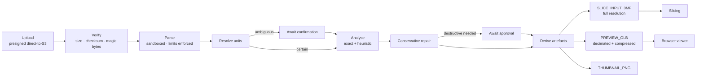
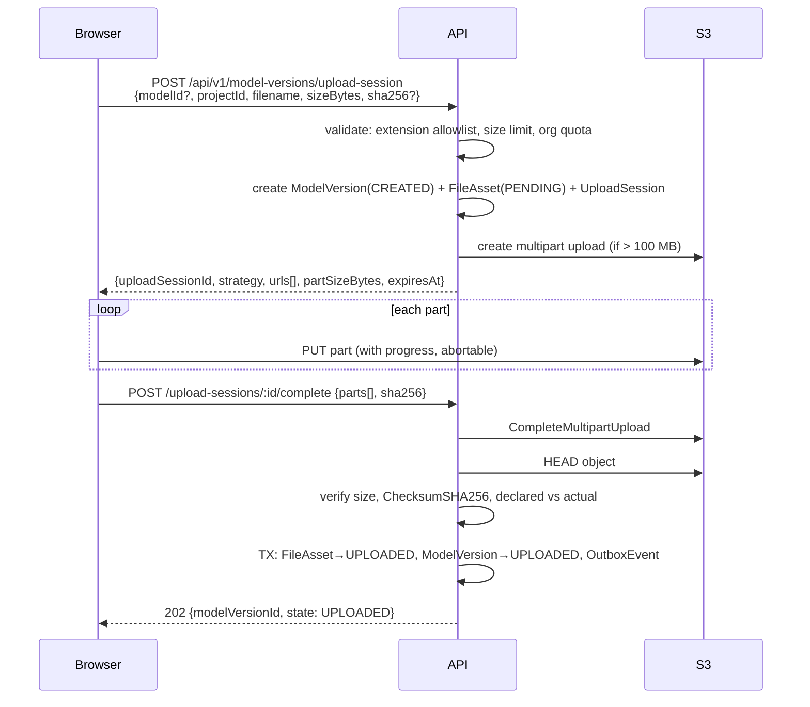
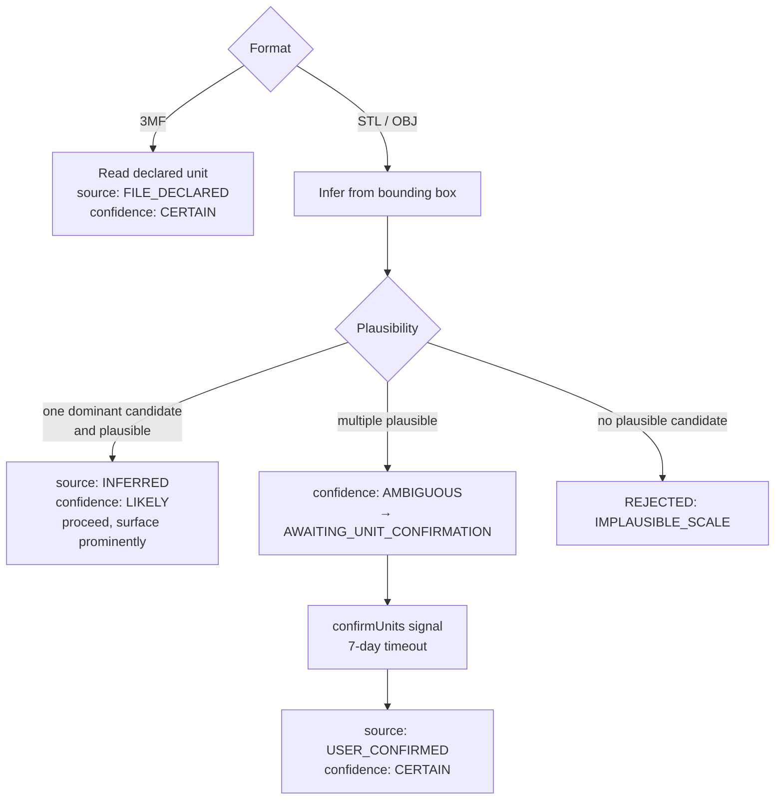

# Metrika — 3D Pipeline

> Ingest → validate → analyse → repair → derive → view. Companion to [ARCHITECTURE.md](./ARCHITECTURE.md) and [DOMAIN_MODEL.md](./DOMAIN_MODEL.md).

---

## 1. Pipeline overview



Two artefacts leave this pipeline and they are **not the same mesh**:

- **`SLICE_INPUT_3MF`** — repaired, full resolution, unit-normalised. This is what gets sliced and what determines material cost.
- **`PREVIEW_GLB`** — decimated to a triangle budget, compressed, no more than an approximation. This is what the browser gets.

Slicing the preview would silently under-report material. Rendering the slice input would kill the browser on a 20 M-triangle model. The separation is deliberate and enforced by `ModelDerivative.kind`.

There is a second reason for the split, and it is arguably more important than performance: **the browser never receives the customer's original geometry.** A leaked preview URL leaks a 300 k-triangle approximation of a building, not the source file an architect would be professionally embarrassed to lose. Confidentiality (§62) is served by the same mechanism as performance.

---

## 2. Ingest

### Upload flow



**The API never proxies model bytes.** A 900 MB architectural model passing through a Fargate task would consume memory, block an event loop, and cost bandwidth twice.

**Multipart above 100 MB**, 16 MB parts, with per-part presigned URLs. This gives real per-part progress, resumability, and cancellation. Below 100 MB a single presigned `PUT` is simpler and faster.

**Checksums**: the browser computes SHA-256 in a Web Worker while selecting the file (streaming, so a 900 MB file does not blow the tab's memory) and declares it in the session. S3 verifies it via `x-amz-checksum-sha256`. The API cross-checks the returned checksum against the declared one on completion. A mismatch is `CHECKSUM_MISMATCH` and the object is moved to `quarantine/`.

**Progress is never faked.** `XMLHttpRequest.upload.onprogress` (or `fetch` with a stream) reports real bytes. After upload completes, the UI switches to the SSE-driven processing states, which are also real. A fake progress bar that jumps to 90% and waits is worse than an honest indeterminate spinner.

### Validation gates, in order

| Gate                           | Limit                                      | Failure code               |
| ------------------------------ | ------------------------------------------ | -------------------------- |
| Extension allowlist            | `.stl`, `.obj`, `.3mf`                     | `UNSUPPORTED_FILE_FORMAT`  |
| Declared size                  | 1 GB default, per-org configurable         | `FILE_TOO_LARGE`           |
| Org storage quota              | Configurable per plan                      | `QUOTA_EXCEEDED`           |
| Actual size (post-upload)      | Must match declared ±0                     | `CHECKSUM_MISMATCH`        |
| Magic bytes / structural sniff | Must match declared format                 | `UNSUPPORTED_FILE_FORMAT`  |
| Archive expansion (3MF)        | ≤ 500 entries, ≤ 200:1 ratio, ≤ 4 GB total | `MALICIOUS_ARCHIVE`        |
| XML entity expansion (3MF)     | `defusedxml`, no DTD, no external entities | `MALICIOUS_ARCHIVE`        |
| Triangle count                 | 50 M default                               | `MODEL_TOO_COMPLEX`        |
| Vertex count                   | 30 M default                               | `MODEL_TOO_COMPLEX`        |
| Parse wall clock               | 300 s (large queue)                        | `GEOMETRY_ANALYSIS_FAILED` |
| Parse memory                   | `RLIMIT_AS` 2 GB (small) / 8 GB (large)    | `GEOMETRY_ANALYSIS_FAILED` |

**Format detection never trusts the extension.** Binary STL is detected by an 80-byte header plus a triangle count matching `(fileSize - 84) / 50`; ASCII STL by a `solid` prefix _and_ a `facet normal` within the first few KB (the `solid` prefix alone is famously unreliable). 3MF is a ZIP with `[Content_Types].xml` and `3D/3dmodel.model`. OBJ is text and is validated by successfully parsing a leading window of `v`/`f` directives.

**Triangle count is estimated before parsing** where possible — for binary STL it is `(fileSize - 84) / 50` exactly — so an oversized model is rejected without ever allocating it. This is a resource-exhaustion defence, not a nicety.

**OBJ material references are stripped, never resolved.** `mtllib ../../../etc/passwd` and `map_Kd http://169.254.169.254/latest/meta-data/` are the path-traversal and SSRF vectors in an otherwise innocuous text format. The parser discards all external references; the worker has no network egress anyway, which is the second layer.

---

## 3. Units

Detailed model in [DOMAIN_MODEL.md](./DOMAIN_MODEL.md#4-units). Pipeline behaviour:



The inference heuristic scores each candidate unit by the implied real-world size against a prior for architectural models (a building is 3–300 m; a detail model is 0.1–5 m; a printed maquette is 20–400 mm). It is a **heuristic and is labelled as one** — the UI says "parece estar en metros" ("appears to be in metres"), never "is in metres".

**No price is ever computed from an `AMBIGUOUS` unit interpretation.** The quote endpoint returns `UNITS_NOT_CONFIRMED` if it is asked to.

The UX matters as much as the model here. The confirmation card shows all three interpretations side by side with their implied real-world size and their implied printed size at the currently selected scale, so the architect is choosing between "this is a 184 m building" and "this is a 184 mm object" rather than between the abstract words "metres" and "millimetres".

---

## 4. Geometry analysis

Runs in the geometry worker. **Exact and heuristic results are structurally separated** — see [DOMAIN_MODEL.md](./DOMAIN_MODEL.md#22-models--geometry).

### Exact — computed, not estimated

| Metric                        | Method                                            | Notes                                                                                            |
| ----------------------------- | ------------------------------------------------- | ------------------------------------------------------------------------------------------------ |
| Triangle / vertex count       | direct                                            | —                                                                                                |
| Connected components          | `trimesh.graph.connected_components`              | Face adjacency                                                                                   |
| Watertight                    | `mesh.is_watertight`                              | Every edge shared by exactly two faces                                                           |
| Manifold                      | edge-manifold + vertex-manifold check             | Stricter than watertight; reported separately                                                    |
| Consistent winding            | `mesh.is_winding_consistent`                      | —                                                                                                |
| Volume                        | signed tetrahedron sum                            | **Meaningless if not watertight** — reported as `null`, never as a number, when the mesh is open |
| Surface area                  | triangle area sum                                 | Valid regardless of watertightness                                                               |
| AABB                          | direct                                            | Post unit-normalisation, in mm                                                                   |
| Oriented bounding box         | `trimesh.bounds.oriented_bounds`                  | Better for fit-check on rotated models                                                           |
| Centre of mass                | volume-weighted centroid                          | Requires watertight; else `null`                                                                 |
| Degenerate / duplicate faces  | zero-area within epsilon; identical index triples | Counted and sampled                                                                              |
| Boundary / non-manifold edges | edge-incidence counts                             | Sampled face indices stored for viewer highlighting                                              |

The volume rule is worth stating explicitly because it is a common source of silently wrong numbers: **a non-watertight mesh has no defined volume.** Returning a signed-sum "volume" for an open mesh produces a plausible-looking number that can be wildly wrong, and if it ever reached the pricing engine it would produce a wrong price. It is `null`, and `null` blocks the paths that need it.

### Heuristic — labelled, with confidence

| Heuristic              | Method                                                       | Confidence | Why it is hard                                                                                 |
| ---------------------- | ------------------------------------------------------------ | ---------- | ---------------------------------------------------------------------------------------------- |
| Minimum wall thickness | ray-cast sampling from surface points along inverted normals | MEDIUM     | True minimum requires medial-axis computation; sampling can miss a thin region between samples |
| Overhang area          | face normal vs build direction, threshold 45°                | HIGH       | Genuinely simple given a build direction — but the build direction depends on orientation      |
| Unsupported regions    | overhang faces with no material beneath along −Z             | MEDIUM     | Approximates what the slicer will actually do                                                  |
| Fragile regions        | thin-wall clusters weighted by unsupported span              | LOW        | Materially dependent on material and print settings                                            |
| Printability score     | weighted composite                                           | LOW        | A convenience summary; never the basis of a rejection                                          |

**Open architectural decision:** the wall-thickness algorithm (ray sampling vs. medial-axis vs. voxel) is unresolved and resolved at Phase 3 by measuring accuracy and runtime against the fixture set. Whichever wins ships labelled MEDIUM confidence with its sample count exposed.

A `BLOCKER`-severity issue may only ever have `certainty: EXACT`. A heuristic can warn; it can never block a customer from ordering. That rule prevents the worst failure mode of automated printability analysis — refusing a perfectly printable model because a sampling heuristic found a false thin wall.

---

## 5. Repair

Two tiers, with a hard line between them.

**Conservative — automatic, always applied, always logged:**

| Operation                 | Effect                                     | Why it is safe                                          |
| ------------------------- | ------------------------------------------ | ------------------------------------------------------- |
| `WELD_VERTICES`           | merge vertices within 1e-6 × bbox diagonal | Below any manufacturable resolution                     |
| `REMOVE_DEGENERATE_FACES` | drop zero-area triangles                   | They contribute nothing and break downstream algorithms |
| `REMOVE_DUPLICATE_FACES`  | drop identical index triples               | Pure noise                                              |
| `FIX_WINDING`             | make face winding consistent               | Does not move a single vertex                           |
| `RECOMPUTE_NORMALS`       | regenerate from winding                    | Does not move a single vertex                           |

None of these change the shape. Each is recorded in `RepairLog` with before/after metrics and the `repairAlgorithmVersion`.

**Destructive — requires explicit customer approval:**

| Operation                 | Effect                                                       |
| ------------------------- | ------------------------------------------------------------ |
| `FILL_HOLES`              | close boundary loops above a size threshold                  |
| `MANIFOLD_RECONSTRUCT`    | Manifold3D reconstruction — can substantially alter geometry |
| `REMOVE_SMALL_COMPONENTS` | drop disconnected fragments below a volume threshold         |

The workflow enters `AWAITING_REPAIR_APPROVAL` and waits on an `approveDestructiveRepair` signal. The UI shows before/after previews side by side, with the affected regions highlighted and the changed volume stated numerically. `RepairLog.approvedByUserId` is `NOT NULL` for these operations, enforced by a check constraint.

**The original is never modified.** Repairs produce a `REPAIRED_MESH` derivative; the original `FileAsset` is immutable and retained. A customer can always download exactly what they uploaded, and a repair algorithm upgrade regenerates derivatives without touching the source of truth.

---

## 6. Preview generation

```
repaired mesh
  → decimate to ≤ 300 k triangles (quadric edge collapse, preserving boundaries and sharp features)
  → weld + recompute normals
  → generate LOD chain if still large: 300k / 100k / 30k
  → export glTF 2.0 binary (.glb)
  → geometry compression (Meshopt or Draco — see below)
  → upload to derivatives/{orgId}/{modelVersionId}/PREVIEW_GLB/{producerVersion}/model.glb
  → render a 512×512 thumbnail offscreen for list views
```

**Why glTF/GLB rather than serving the STL:**

|                              | Binary STL                               | GLB + Meshopt                               |
| ---------------------------- | ---------------------------------------- | ------------------------------------------- |
| Bytes per triangle           | ~50, no vertex reuse                     | ~6–12 with indexed vertices and compression |
| Indexed geometry             | No — every triangle repeats its vertices | Yes                                         |
| Normals                      | Per-face only; loses smooth shading      | Per-vertex                                  |
| Parse cost                   | Must de-duplicate vertices client-side   | Direct to GPU buffers                       |
| Multiple objects / materials | No                                       | Yes — needed for component selection        |
| LOD / streaming              | No                                       | Yes                                         |

A 5 M-triangle STL is ~250 MB. The same geometry decimated to 300 k triangles and Meshopt-compressed is typically 2–5 MB. That is the difference between a viewer that works on a Colombian office connection and one that does not.

**Open decision:** Meshopt vs Draco. Draco compresses smaller; Meshopt decodes several times faster and has a much simpler pipeline. Current lean is Meshopt because decode time is the user-visible cost. Resolved at Phase 3 by measuring both on real architectural models.

**Decimation preserves what matters for the customer's judgement:** boundary edges, sharp feature edges above a dihedral threshold, and UV seams if present. An architect looking at a decimated maquette must still recognise their building.

---

## 7. Slice input generation

Separate derivative, generated in the same workflow:

```
repaired mesh (full resolution, no decimation)
  → normalise to millimetres using the confirmed unit interpretation
  → export 3MF (lossless, unit-declared, single source of truth for the slicer)
  → upload to derivatives/.../SLICE_INPUT_3MF/...
```

3MF rather than STL for the slicer input because 3MF declares its unit explicitly, which removes the unit ambiguity permanently from every downstream step. The unit question is asked once, at ingest, and never again.

Scale and orientation are **not** baked into this derivative — they live on `PrintConfiguration` and are passed to the slicer as transform parameters. Baking them in would mean a new derivative per configuration, destroying the slice cache's ability to share the input mesh across configurations.

---

## 8. The viewer

### Structure

```
features/model-viewer/
├── components/
│   ├── ModelViewer.tsx           # <Canvas> + Suspense + error boundary
│   ├── ModelMesh.tsx             # the GLB, with material variants
│   ├── BuildPlate.tsx            # printer build volume, grid, mm ruler
│   ├── DimensionAnnotations.tsx  # bbox extents as HTML labels
│   ├── OverhangOverlay.tsx       # custom shader
│   ├── IssueHighlight.tsx        # subset mesh from GeometryIssue.detail
│   ├── CrossSection.tsx          # local clipping planes
│   └── ViewerControls.tsx        # camera presets, overlay toggles, fit-to-view
├── hooks/
│   ├── useModelGeometry.ts       # GLB load, decoder setup, disposal
│   ├── useFitToView.ts
│   └── useViewerStore.ts         # Zustand — camera mode, overlays, selection
└── lib/
    ├── coordinates.ts            # PRINTER_TO_SCENE, MM_TO_SCENE — the ONLY place
    └── camera.ts                 # fit computation
```

### Coordinate conventions — declared once

glTF is **Y-up**. 3D printers are **Z-up**. This mismatch produces a specific, recurring class of bug where someone adds a `rotation.x = -Math.PI / 2` in a component to make something look right, and three months later nothing agrees about which way is up.

The rule: **the viewer scene is glTF-native Y-up. Exactly one module converts printer-space to scene-space.**

```ts
// features/model-viewer/lib/coordinates.ts — the only file allowed to define these
export const MM_TO_SCENE = 0.01; // 1 scene unit = 100 mm
export const PRINTER_TO_SCENE = new Matrix4().makeRotationX(-Math.PI / 2);
export function printerVecToScene(v: Vec3Mm): Vector3 {
  /* ... */
}
```

Build volumes, orientations and dimension annotations come from the domain in printer space and pass through this module. A lint rule forbids `makeRotationX` and raw `rotation.` assignments elsewhere in the feature.

### Capabilities

| Capability                  | Implementation                                                                                                                             |
| --------------------------- | ------------------------------------------------------------------------------------------------------------------------------------------ |
| Orbit / zoom / pan          | `OrbitControls` (drei), damped, with min/max distance bounded by model size                                                                |
| Perspective ↔ orthographic | Two cameras, shared target; orthographic is what architects expect for elevations                                                          |
| Grid + mm scale             | `Grid` (drei) with major/minor divisions at 10 mm / 100 mm, labelled                                                                       |
| Model centring              | Translate by the negated AABB centre; sit the model on the plate (`minY = 0`)                                                              |
| Bounding box                | `Box3Helper` toggled from the store                                                                                                        |
| Dimensions                  | Three `<Html>` labels (drei) at bbox edge midpoints, showing mm and the real-world equivalent at the current scale                         |
| Build plate                 | Printer build volume from `PrinterProfileVersion`, rendered as a translucent box with a printed footprint outline                          |
| Fit-to-view                 | Compute distance from bbox radius and camera FOV; animate with damping                                                                     |
| Camera reset                | Named presets: iso, front, top, right                                                                                                      |
| Overhang overlay            | Custom `ShaderMaterial` colouring faces by `dot(normal, buildDir)` against a configurable threshold                                        |
| Problematic faces           | Second `Mesh` sharing the buffer geometry with an index subset built from `GeometryIssue.detail.faceIndices`, rendered with polygon offset |
| Wireframe                   | Material flag                                                                                                                              |
| Transparency                | Material opacity, with `depthWrite: false` and back-to-front sort                                                                          |
| Cross-section               | `renderer.localClippingEnabled` + a draggable `Plane`; a capped cross-section (stencil) is V2                                              |
| Component selection         | Raycast against child meshes when the GLB has multiple primitives                                                                          |
| Layer preview               | **V2** — requires parsing G-code into a line geometry; deferred deliberately                                                               |

### Loading, errors and large models

- Loading is staged and honest: `fetching GLB (n%) → decoding → building scene`. The SSE processing states cover everything before the GLB exists.
- A parse failure renders an error state with the analysis's `failureCode`, not a blank canvas.
- If the decimated preview still exceeds the triangle budget, the LOD chain is used: load the coarsest first, swap up as the finer levels arrive. The viewer is interactive within a second even for a very large model.
- **WebGL context loss is handled** — `webglcontextlost` triggers a recoverable UI state and a re-init, rather than a frozen canvas. This happens on real laptops with real GPU pressure and is otherwise reported as "the viewer is broken".

### Performance

- `frameloop="demand"` with explicit `invalidate()` on interaction. An idle viewer must consume no GPU.
- Budgets: ≤ 300 k triangles, ≤ 150 MB GPU, ≤ 400 KB gzip for the lazily-loaded viewer chunk.
- **Disposal is mandatory and tested.** On unmount, every `BufferGeometry`, `Material` and `Texture` is disposed and the GLTF cache entry cleared. A leak here is the single most common R3F production bug and it manifests as "the app gets slower the more models you look at". There is an explicit test that mounts and unmounts the viewer 50 times and asserts `renderer.info.memory` returns to baseline.
- The viewer chunk is a dynamic import, never in the shared bundle. A user reading their order history should not download Three.js.
