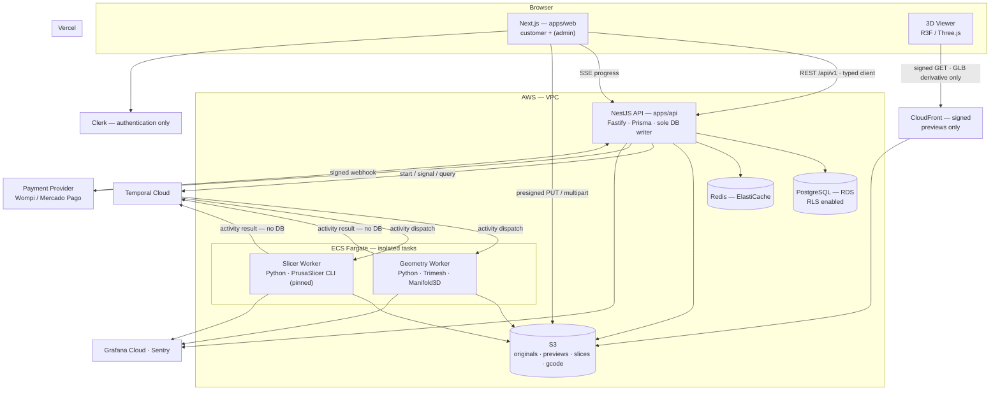
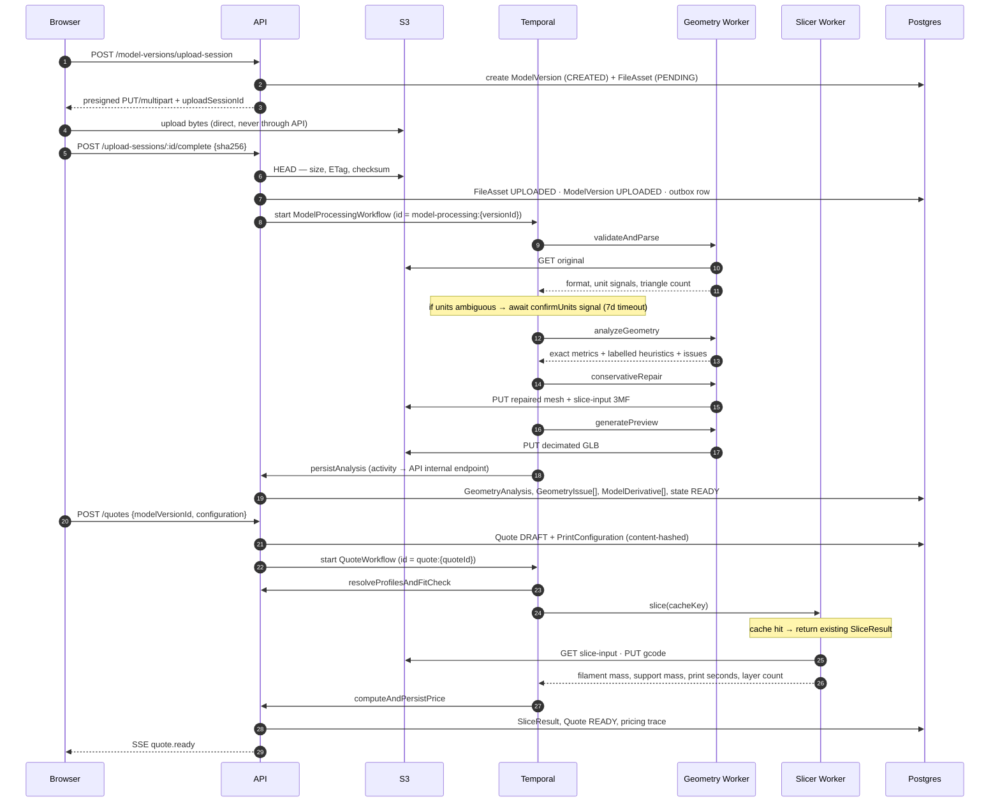
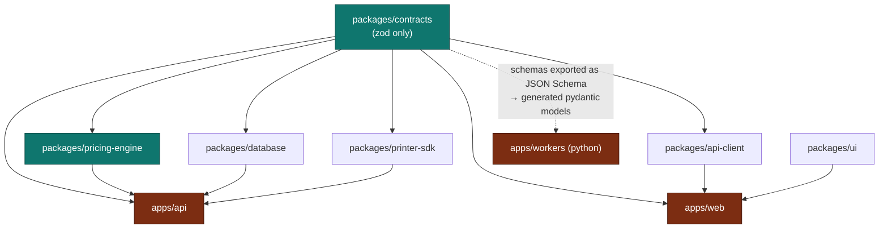
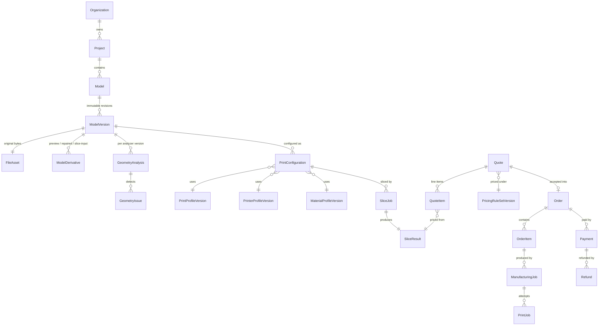
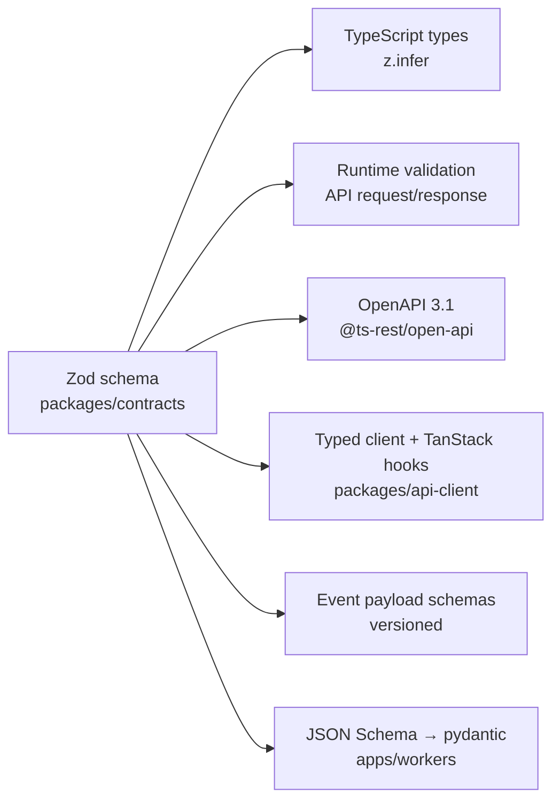
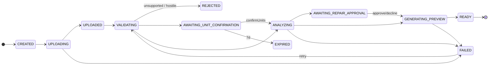
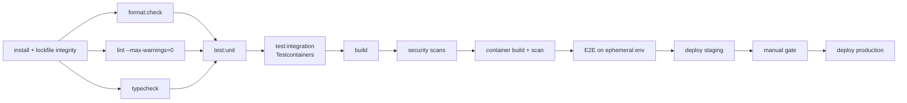

# Metrika — Architecture

> **Status:** Blueprint (pre-implementation). No application code exists yet.
> **Audience:** Any senior engineer picking up implementation without re-deriving fundamental decisions.
> **Scope:** This document is the spine. Deep-dives live in sibling documents and are linked inline.

| Deep-dive                                                | Covers                                                                     |
| -------------------------------------------------------- | -------------------------------------------------------------------------- |
| [DOMAIN_MODEL.md](./DOMAIN_MODEL.md)                     | Entities, relationships, Prisma design, state machines, money, units       |
| [3D_PIPELINE.md](./3D_PIPELINE.md)                       | Ingest, geometry analysis, repair, preview generation, viewer, scale & fit |
| [SLICING.md](./SLICING.md)                               | Slicer abstraction, containerisation, caching, reproducibility, licensing  |
| [PRICING_ENGINE.md](./PRICING_ENGINE.md)                 | Pure pricing kernel, versioned rule sets, trace, rounding, tax             |
| [CONTRACTS_AND_API.md](./CONTRACTS_AND_API.md)           | Zod-first contracts, ts-rest, REST design, errors, API client              |
| [WORKFLOWS.md](./WORKFLOWS.md)                           | Temporal workflows/activities, events, outbox, idempotency, SSE            |
| [SECURITY.md](./SECURITY.md)                             | Security architecture + threat model                                       |
| [OBSERVABILITY.md](./OBSERVABILITY.md)                   | Tracing, metrics, logging, business KPIs                                   |
| [TESTING.md](./TESTING.md)                               | Unit/integration/contract/E2E/geometry/slicer-regression strategy          |
| [TYPESCRIPT_AND_TOOLING.md](./TYPESCRIPT_AND_TOOLING.md) | tsconfig, ESLint, Prettier, package builds, versions                       |
| [INFRASTRUCTURE.md](./INFRASTRUCTURE.md)                 | Docker, Terraform, AWS, CI/CD, environments, cost model                    |
| [LOCAL_DEVELOPMENT.md](./LOCAL_DEVELOPMENT.md)           | Clone-to-running, seeds, fixtures                                          |
| [PRINTER_INTEGRATION.md](./PRINTER_INTEGRATION.md)       | PrinterDriver SDK (future hardware)                                        |
| [ROADMAP.md](./ROADMAP.md)                               | Phases 0–15, MVP/V1/V2/Future classification, per-task granularity         |
| [RISK_REGISTER.md](./RISK_REGISTER.md)                   | Technical risks, probability, impact, mitigation                           |
| [adr/](./adr/)                                           | Architecture Decision Records                                              |

---

## 1. Executive technical summary

Metrika turns an uploaded 3D model into a **binding, reproducible manufacturing quote** and then into a manufactured physical object. Everything else in this architecture is subordinate to one property:

> **For any accepted quote, the system must be able to reconstruct the exact chain of inputs that produced its price, indefinitely, even after every profile, rule and version in the system has changed.**

That single requirement — not scale, not traffic — is what makes this a hard system. It dictates immutable versioning of every manufacturing-relevant configuration, content-addressed inputs, deterministic computation kernels, and durable orchestration. Reject any design that trades it away for convenience.

The system is a **modular monolith API + stateless specialised workers + durable workflows**:

- **`apps/api`** — NestJS on Fastify. Owns the database, all business rules, all authorization, all persistence. The only writer to Postgres.
- **`apps/workers`** — Python. Stateless compute for geometry analysis and slicing. **No database access.** Reads/writes S3, receives inputs and returns results through Temporal activity boundaries.
- **`apps/web`** — Next.js App Router. Customer platform plus an `(admin)` route group. Talks to the API through a generated, typed client.
- **Temporal Cloud** — orchestrates the multi-minute, multi-step, failure-prone pipelines (model processing, quote generation, order fulfilment) and provides retries, timeouts, cancellation, compensation and workflow versioning that we would otherwise hand-write badly.

Three computational kernels are **pure functions** with no I/O, living in packages, testable in isolation, and 100%-covered: the **pricing engine**, the **authorization policies**, and the **state machines**. If a bug can cost money or leak a customer's confidential building, it lives in a pure function with golden-file tests.

Non-negotiable invariants, stated once:

1. Money is `bigint` minor units plus an explicit currency and exponent. Never a float, never a `number`.
2. Every physical quantity carries its unit in its name and, where it flows into money, in its type.
3. No heavy geometry or slicing work happens inside an HTTP request.
4. Workers never touch Postgres.
5. Every tenant-scoped query carries an authorization context, backed by Postgres row-level security.
6. Every manufacturing-relevant configuration is immutable and versioned; quotes reference versions, never current pointers.
7. Customer geometry is never modified without a recorded, versioned, reversible repair log.

### Why this is not over-engineering

A reasonable reviewer will ask whether Temporal, RLS, content addressing and a versioned pricing kernel are premature for a pre-revenue company. The test applied throughout was: _does removing this create a data-correctness problem that is expensive or impossible to fix later?_

- **Versioned profiles and pricing** — retrofitting is a data migration against quotes you have already honoured commercially. Keep.
- **Temporal** — replaceable, but the alternative is hand-writing workflow versioning, which is the genuinely hard part. Keep, hosted.
- **Postgres RLS** — retrofitting means auditing every query ever written. Keep.
- **Content-addressed slice cache** — pure cost saving, but the cache key doubles as the reproducibility key. Keep.
- **`apps/admin` as a separate deployable** — no correctness cost to defer. **Cut**, revisit at Phase 11.
- **`packages/storage`, `packages/observability`, `packages/config`** — thin wrappers with one consumer each. **Cut**, revisit when a second consumer exists.

### Delivery context

This system is being built by a single engineer working with AI coding agents, with no fixed deadline and a correctness-first mandate. Three consequences run through every decision below:

- **Small, well-bounded packages** with explicit public APIs. An agent reasons well about a 400-line module with a typed boundary and badly about a 4,000-line service.
- **The type system and lint gates replace the human reviewer.** Rules that would be "nice to have" on a team with code review are load-bearing here. This is why the ESLint and TypeScript configurations are unusually strict, and why `--max-warnings=0` is enforced in CI.
- **Managed infrastructure over self-hosted**, everywhere the operational burden does not buy a capability. There is no on-call rotation.

---

## 2. Architecture principles

1. **Reproducibility over convenience.** Any input to a price is versioned and immutable.
2. **Purity at the core.** Pricing, policy and state transitions are pure functions. I/O happens at the edges.
3. **Compute is stateless; state lives in Postgres and S3.** Workers can be killed at any moment.
4. **Fail loudly at boundaries, never in the middle.** Validate and narrow all external data (uploads, webhooks, slicer output, env) at the point of entry with Zod/Pydantic. Inside the domain, types are trusted because they were earned.
5. **One source of truth per concept.** A schema is defined once in `packages/contracts` and flows to validation, OpenAPI, client types and events by derivation, never by duplication.
6. **Structural enforcement over discipline.** Where a rule can be enforced by a type, a database constraint, a lint rule or an RLS policy, it is — because there is no second pair of human eyes.
7. **Heuristics are labelled as heuristics.** A minimum-wall-thickness estimate and a watertightness test are not the same kind of claim and must not be presented identically.
8. **Degenerate cases of the general model, not special cases.** MVP always prints one part per order item — but the schema models N parts, so segmentation is a feature, not a migration.
9. **Defer distribution.** One deployable API. Workers are separate because they have different runtimes, resource profiles and blast radius — not because "microservices."
10. **No hidden debt.** A shortcut is either an ADR with a documented consequence or it is not taken.

---

## 3. Final technology stack

| Layer           | Choice                                                                                      | Why it wins                                                                                                               | Principal disadvantage                                                                                                                                                  |
| --------------- | ------------------------------------------------------------------------------------------- | ------------------------------------------------------------------------------------------------------------------------- | ----------------------------------------------------------------------------------------------------------------------------------------------------------------------- |
| Package manager | **pnpm** + workspaces                                                                       | Strict node_modules prevents phantom dependencies — critical when enforcing package boundaries                            | Occasional tooling that assumes hoisting                                                                                                                                |
| Task runner     | **Turborepo**                                                                               | Content-hash caching of lint/typecheck/test/build; remote cache makes CI cheap                                            | Another config surface; cache invalidation subtleties                                                                                                                   |
| Frontend        | **Next.js (App Router) + React + TypeScript**                                               | RSC for the data-heavy dashboards, mature ecosystem, Vercel deploy is one less thing to run                               | App Router complexity; the viewer is entirely client-side regardless                                                                                                    |
| 3D              | **Three.js + React Three Fiber + Drei**                                                     | Declarative scene graph composes with React state; Drei covers controls/helpers                                           | R3F adds a reconciler layer; perf work sometimes needs to drop to imperative Three                                                                                      |
| Styling         | **Tailwind + shadcn/ui**                                                                    | shadcn is copy-in, not a dependency — we own and can restyle the components                                               | Copy-in means no upstream fixes; must be maintained                                                                                                                     |
| Server state    | **TanStack Query**                                                                          | Caching, dedup, retries, invalidation; SSE updates write into its cache                                                   | Learning curve on cache-key discipline                                                                                                                                  |
| Client state    | **Zustand**, two small stores                                                               | Minimal, no provider tree, easy to test                                                                                   | Easy to abuse — see §8 for the hard rules                                                                                                                               |
| Forms           | **React Hook Form + Zod**                                                                   | The print-configuration form is the only genuinely complex form; RHF handles it without re-render storms                  | —                                                                                                                                                                       |
| API             | **NestJS + Fastify adapter**                                                                | DI and module boundaries are exactly what a modular monolith needs; Fastify for throughput and schema-first serialisation | Decorator-heavy; Nest's own docs assume Jest and class-validator, both of which we reject                                                                               |
| Contracts       | **Zod + ts-rest**                                                                           | One Zod contract yields runtime validation, OpenAPI, server type-checking and a typed TanStack Query client               | Smaller community than `@nestjs/swagger`; constrains API shape. See [ADR-0009](./adr/0009-ts-rest-contracts.md) — lock-in is shallow because the source of truth is Zod |
| ORM             | **Prisma**                                                                                  | Best-in-class migrations and type generation; the schema file is a readable single source of truth                        | Weak on advanced SQL; `exactOptionalPropertyTypes` friction; RLS needs a client extension                                                                               |
| Database        | **PostgreSQL 16**                                                                           | Transactions, JSONB, RLS, partial/expression indexes, `numeric` — every feature this design leans on                      | —                                                                                                                                                                       |
| Orchestration   | **Temporal Cloud**                                                                          | Durable execution with real workflow versioning; workflow ID is a free idempotency key                                    | Learning curve; non-determinism bugs are confusing; a paid dependency                                                                                                   |
| Geometry        | **Python + Trimesh + NumPy + SciPy + Manifold3D**                                           | Trimesh is the only mature open mesh-analysis library; Manifold3D gives guaranteed-manifold boolean/repair                | Python memory behaviour under large meshes needs hard limits                                                                                                            |
| Slicing         | **PrusaSlicer CLI, pinned by image digest**                                                 | Industrial-grade, well-understood G-code output, good CLI metrics                                                         | **AGPL — requires formal legal review before launch.** See [SLICING.md](./SLICING.md)                                                                                   |
| Object storage  | **Amazon S3**                                                                               | Presigned uploads, checksums, lifecycle, versioning, per-prefix IAM                                                       | —                                                                                                                                                                       |
| Cache/locks     | **Redis (ElastiCache)**                                                                     | Rate limiting, ephemeral locks, hot-read cache. **Never a source of truth**                                               | Another managed service to pay for; deferrable to Phase 2                                                                                                               |
| Auth            | **Clerk (authentication only)**                                                             | Fast, good Next.js integration, covers Google/Microsoft/email + MFA. **Metrika owns organizations and roles.**            | Vendor cost; must resist its Organizations feature. See [ADR-0012](./adr/0012-authentication.md)                                                                        |
| Payments        | **Provider-agnostic adapter**; Wompi or Mercado Pago first                                  | Colombia needs PSE and Nequi, which Stripe does not offer                                                                 | Redirect + async-webhook flow is the required superset shape                                                                                                            |
| Observability   | **OpenTelemetry → Grafana Cloud**, plus Sentry                                              | One OTLP endpoint for traces/metrics/logs; Grafana-native as required                                                     | Free tier limits; Sentry overlaps slightly                                                                                                                              |
| Runtime hosting | **Vercel (web) + AWS ECS Fargate (api, workers)**                                           | Vercel for RSC/edge quality; Fargate for containers we control and can resource-limit                                     | Two ops surfaces, two secret stores, cross-origin auth to design deliberately                                                                                           |
| IaC             | **Terraform**                                                                               | Mature, AWS-complete, reviewable plans                                                                                    | HCL verbosity; state management to set up carefully                                                                                                                     |
| Python deps     | **uv + pyproject.toml**                                                                     | Fast, lockfile-based, workspace support                                                                                   | Young relative to pip, but the lockfile is the point                                                                                                                    |
| Test runner     | **Vitest** (TS), **pytest + Hypothesis** (Python), **Playwright** (E2E), **Testcontainers** | One TS runner for unit and integration; Hypothesis property-tests geometry maths                                          | Nest examples assume Jest; small adaptation cost                                                                                                                        |

### Stack choices deliberately rejected

- **Kafka / event bus** — a transactional outbox in Postgres delivers the four events that need durability. Kafka buys partitioned throughput we do not have and an operational burden we cannot absorb.
- **GraphQL** — the client is one first-party app with well-known access patterns. REST + a generated typed client gives the same DX without resolver N+1 risk.
- **class-validator DTOs** — would force maintaining a second schema definition alongside Zod, in direct violation of §5.
- **Jest** — slower, worse ESM story, and we would still need a second runner.
- **Self-hosted Temporal** — Cassandra or a large Postgres plus history/matching/frontend services. Not for a solo operator.
- **A generic `Repository<T>` wrapper over Prisma** — see §16.
- **Microservices** — no independent scaling need, no team boundaries to mirror, and it would make cross-entity transactions (quote acceptance → order creation) distributed for no benefit.

---

## 4. Architecture diagram

### System context



### The quote pipeline — the critical path



---

## 5. Monorepo strategy

**One repository, pnpm workspaces, Turborepo for task orchestration.** Node packages are workspace members; the Python workers are a **separate uv workspace** rooted at `apps/workers/`, invoked from Turbo through thin `package.json` shims so `pnpm lint` / `pnpm test` cover Python too without pnpm trying to manage Python dependencies.

```
pnpm-workspace.yaml:  apps/*  packages/*        # apps/workers has a package.json shim only
apps/workers/pyproject.toml: [tool.uv.workspace] members = ["packages/*", "geometry", "slicer"]
```

**Internal packages are source-only.** Each exports `"./src/index.ts"` directly; Next transpiles them via `transpilePackages`, the API compiles them through TypeScript project references, and Vitest resolves them natively. This removes an entire build step from the inner loop. Correctness is preserved by a separate cached `typecheck` task (`tsc -b`) that must pass in CI. See [TYPESCRIPT_AND_TOOLING.md](./TYPESCRIPT_AND_TOOLING.md#5-package-builds).

**Turborepo pipeline** (`turbo.json`):

| Task               | Depends on   | Cached | Notes                                             |
| ------------------ | ------------ | ------ | ------------------------------------------------- |
| `typecheck`        | `^typecheck` | yes    | `tsc -b`; topological                             |
| `lint`             | `^typecheck` | yes    | type-aware rules need built types of dependencies |
| `test:unit`        | `^typecheck` | yes    | no external services                              |
| `test:integration` | `^build`     | no     | Testcontainers; not cached (container state)      |
| `build`            | `^build`     | yes    | only apps and publishable packages                |
| `db:generate`      | —            | yes    | Prisma client; input = `schema.prisma`            |

Remote caching (Vercel Remote Cache) is enabled from Phase 0 — it is free for this scale and turns a 6-minute CI run into 40 seconds on unchanged packages.

**Why not Nx?** Nx's generators and module-boundary enforcement are genuinely better, but Turborepo is simpler, and boundary enforcement is handled here by ESLint `no-restricted-imports` zones (§7), which are explicit and readable. Not worth the migration surface. See [ADR-0001](./adr/0001-monorepo-strategy.md).

---

## 6. Complete repository tree

```
metrika/
├── apps/
│   ├── web/                          # Next.js 15 App Router
│   │   ├── src/
│   │   │   ├── app/
│   │   │   │   ├── (marketing)/            # public, static, es-CO
│   │   │   │   ├── (app)/                  # authenticated customer platform
│   │   │   │   │   ├── projects/[projectId]/
│   │   │   │   │   │   └── models/[modelId]/versions/[versionId]/
│   │   │   │   │   ├── quotes/[quoteId]/
│   │   │   │   │   ├── orders/[orderId]/
│   │   │   │   │   └── settings/
│   │   │   │   ├── (admin)/                # role-gated; extracted to apps/admin at Phase 11
│   │   │   │   └── api/                    # BFF only: SSE relay, auth callbacks. NOT business logic
│   │   │   ├── features/                   # ← the real structure; see §8
│   │   │   │   ├── auth/ organizations/ projects/ models/ model-viewer/
│   │   │   │   ├── geometry-analysis/ print-configuration/ quotes/
│   │   │   │   ├── checkout/ orders/ admin-*/
│   │   │   ├── lib/                        # cross-feature: query client, api client wiring, i18n, formatting
│   │   │   └── config/env.ts               # Zod-validated; the ONLY process.env reader
│   │   └── e2e/                            # Playwright
│   │
│   ├── api/                          # NestJS + Fastify
│   │   ├── src/
│   │   │   ├── main.ts
│   │   │   ├── app.module.ts               # composition root only — no logic
│   │   │   ├── config/env.ts               # Zod-validated; the ONLY process.env reader
│   │   │   ├── shared/                     # cross-cutting: errors, request context, pagination, clock
│   │   │   ├── authorization/              # policies (pure), guards, decorators
│   │   │   ├── infrastructure/
│   │   │   │   ├── persistence/            # PrismaService, RLS extension, mappers, brand helpers
│   │   │   │   ├── storage/                # S3 adapter, presigning, key namespaces
│   │   │   │   ├── temporal/               # client, workflow starters, outbox dispatcher
│   │   │   │   ├── payments/               # PaymentProvider adapters
│   │   │   │   ├── notifications/          # email/in-app adapters
│   │   │   │   └── telemetry/              # OTel bootstrap, logger, metrics registry
│   │   │   ├── modules/                    # one directory per bounded module — §10
│   │   │   └── workflows/                  # Temporal workflow definitions + activity impls (TS side)
│   │   └── test/
│   │
│   └── workers/                      # uv workspace (Python 3.12)
│       ├── pyproject.toml
│       ├── packages/metrika_core/          # shared: pydantic models, S3, telemetry, sandbox limits
│       ├── geometry/                       # Trimesh/Manifold3D activities + Dockerfile
│       └── slicer/                         # PrusaSlicer CLI wrapper + G-code parser + Dockerfile
│
├── packages/
│   ├── contracts/                    # Zod: IDs, Money, units, API contracts, event schemas, enums
│   ├── pricing-engine/               # pure TS pricing kernel
│   ├── api-client/                   # ts-rest client + TanStack Query bindings
│   ├── database/                     # Prisma schema, migrations, seed, client factory
│   ├── ui/                           # design system only (shadcn-derived)
│   ├── printer-sdk/                  # PrinterDriver interface + Null/Simulator  [TODO: Printer Infrastructure]
│   ├── eslint-config/
│   ├── typescript-config/
│   └── testing/                      # Testcontainers helpers, factories, fixture registry
│
├── fixtures/models/                  # committed geometry fixtures + generator script
├── infra/
│   ├── terraform/{modules,envs/{staging,production}}
│   └── docker/                       # Dockerfiles + docker-compose.yml for local
├── docs/                             # this directory
├── scripts/
├── .github/workflows/
├── turbo.json · pnpm-workspace.yaml · package.json · .nvmrc · .python-version
```

### Per-package specification

| Package                      | Responsibility                                                                                                                                                        | May depend on                                      | Must **not** depend on                                                 | Public API                                                                            | Testing                                                                                            |
| ---------------------------- | --------------------------------------------------------------------------------------------------------------------------------------------------------------------- | -------------------------------------------------- | ---------------------------------------------------------------------- | ------------------------------------------------------------------------------------- | -------------------------------------------------------------------------------------------------- |
| `packages/contracts`         | Single source of truth for every cross-boundary schema: branded IDs, `Money`, unit types, REST contracts, domain/integration event payloads (versioned), shared enums | `zod` only                                         | Anything. No Nest, no Prisma, no React, no Node built-ins beyond types | `./` barrel + `./events`, `./ids`, `./money`, `./units` subpaths                      | Unit: schema parse/reject tables; **contract tests** asserting event schema backward compatibility |
| `packages/pricing-engine`    | Pure deterministic price computation from a versioned rule set; emits a full trace                                                                                    | `contracts`, `decimal.js`                          | HTTP, Prisma, Nest, `Date`, `Math.random`, filesystem                  | `computePrice(input): PriceQuoteResult`, `validateRuleSet`, `RULE_SET_SCHEMA_VERSION` | **100% line + branch.** Golden-file tests; property tests for rounding invariants                  |
| `packages/api-client`        | Typed HTTP client from the ts-rest contract: auth injection, request IDs, retry policy, error normalisation, cancellation, TanStack Query hooks                       | `contracts`, `@ts-rest/*`, `@tanstack/react-query` | Prisma, Nest, `apps/*`                                                 | `createMetrikaClient(config)`, generated hooks                                        | Unit with MSW; contract tests against the API's generated OpenAPI                                  |
| `packages/database`          | Prisma schema, migrations, seed data, `createPrismaClient()` with RLS + soft-delete + branding extensions                                                             | `contracts`, `@prisma/client`                      | Nest, React, HTTP                                                      | `createPrismaClient`, `Prisma` namespace re-export, seed entrypoints                  | Integration against Testcontainers Postgres; migration up/down smoke tests                         |
| `packages/ui`                | Design-system primitives only: Button, Input, Dialog, DataTable, Toast, tokens. **No feature components, no data fetching**                                           | `react`, `tailwind`, radix                         | `api-client`, `contracts`, `database`, `apps/*`                        | Named component exports; no deep imports                                              | Storybook + interaction tests; a11y assertions                                                     |
| `packages/printer-sdk`       | `PrinterDriver` interface, capability model, telemetry types, `NullPrinterDriver` and `SimulatorPrinterDriver`. **No hardware code in MVP**                           | `contracts`                                        | Order/quote domain, Prisma, Nest                                       | `PrinterDriver`, `PrinterCapabilities`, driver registry                               | Unit against the simulator; conformance suite reusable by future real drivers                      |
| `packages/eslint-config`     | Composable flat configs: `base`, `typeChecked`, `react`, `next`, `nest`, `test`, `script`                                                                             | eslint plugins                                     | Everything else                                                        | Named config exports                                                                  | Fixture-based: files that must and must not error                                                  |
| `packages/typescript-config` | `base`, `node`, `react-library`, `next`, `nest` tsconfigs                                                                                                             | —                                                  | —                                                                      | JSON configs                                                                          | Compile-fixture tests for the strict flags                                                         |
| `packages/testing`           | Testcontainers harnesses (Postgres/Redis/MinIO/Temporal test env), entity factories, fixture registry, `FakeSlicerEngine`, `FakeGeometryAnalyzer`                     | `contracts`, `database`, testcontainers            | Production `apps/*` code                                               | Harness + factory exports                                                             | Self-tested via the suites that consume it                                                         |
| `apps/api`                   | All business logic, persistence, authorization, transport                                                                                                             | all packages                                       | `apps/web`, `apps/workers` source                                      | REST `/api/v1` + internal workflow endpoints                                          | Unit (services, policies), integration (modules + DB), contract (OpenAPI)                          |
| `apps/web`                   | Presentation and interaction                                                                                                                                          | `contracts`, `api-client`, `ui`                    | `database`, `pricing-engine`†, `apps/api` source                       | —                                                                                     | Component, hook, Playwright E2E                                                                    |
| `apps/workers`               | Stateless geometry and slicing compute                                                                                                                                | `metrika_core`                                     | Postgres, business rules, pricing                                      | Temporal activity signatures                                                          | pytest, Hypothesis, golden-file, slicer regression                                                 |

† `apps/web` must not import `pricing-engine`. Prices are computed server-side and displayed; a client-side re-computation would be a second source of truth and would drift. Estimated "price preview before slicing" is an API endpoint, not a client computation.

---

## 7. Dependency boundaries



Enforced rules, each with a corresponding ESLint `no-restricted-imports` zone in `packages/eslint-config`:

| Rule                                                                                                 | Rationale                                                                                               |
| ---------------------------------------------------------------------------------------------------- | ------------------------------------------------------------------------------------------------------- |
| `contracts` imports nothing but `zod`                                                                | It is the root of the graph. Any dependency here propagates everywhere, including to the browser bundle |
| `pricing-engine` may not import Nest, Prisma, HTTP, `node:fs`, or reference `Date`/`Math.random`     | Purity is what makes golden-file tests meaningful. Time is injected as `evaluatedAt`                    |
| `ui` may not import `api-client`, `contracts` or `database`                                          | A design-system component that knows about a `Quote` is a feature component in the wrong place          |
| `apps/web` may not import `database` or `pricing-engine`                                             | No Prisma in a browser bundle; no second pricing source of truth                                        |
| `printer-sdk` may not import order/quote domain types                                                | The driver layer must be reusable by a future partner-network implementation                            |
| Only `apps/api/src/infrastructure/persistence/**` may import `@prisma/client` or `packages/database` | Forces every query through the mapping + authorization layer                                            |
| Only `apps/api/src/config/env.ts` and `apps/web/src/config/env.ts` may read `process.env`            | §54. Enforced by `no-restricted-properties`                                                             |
| Only `apps/api/src/infrastructure/persistence/**` may import `brandUnsafe`                           | The single controlled place where a DB `string` becomes a branded ID                                    |
| `apps/*` may not import from another app's `src`                                                     | Cross-app sharing goes through a package or it does not happen                                          |

The Python side consumes contracts by **generating pydantic models from JSON Schema emitted by `packages/contracts`** in a `pnpm contracts:emit` step, committed and checked in CI (`git diff --exit-code`). This keeps one source of truth across the language boundary without a runtime dependency.

---

## 8. Frontend architecture

### Structure

Feature-first. A feature owns its components, hooks, schemas and presentation logic; nothing lives in a global `components/` or `utils/` bucket.

```
src/features/print-configuration/
├── components/       # ConfigurationForm, MaterialPicker, ScaleControl, FitIndicator
├── hooks/            # usePrintConfiguration, useFitCheck
├── schemas/          # form schema = contracts schema + UI-only refinements
├── lib/              # pure presentation logic (formatting, derived labels)
└── index.ts          # the feature's public surface — cross-feature imports use only this
```

Cross-feature imports go through `index.ts`. A lint zone forbids `features/*/components/*` deep imports from outside the feature.

### State placement — the hard rules

| State                                  | Home                        | Examples                                                                                            |
| -------------------------------------- | --------------------------- | --------------------------------------------------------------------------------------------------- |
| Shareable / bookmarkable / back-button | **URL**                     | `projectId`, `modelVersionId`, `quoteId`, viewer tab, admin table filters, pagination cursor        |
| Anything the server owns               | **TanStack Query**          | models, analyses, quotes, orders, materials, profiles. Never mirrored elsewhere                     |
| Ephemeral cross-component UI           | **Zustand**, feature-scoped | `viewerStore` (camera mode, overlay toggles, selection), `uploadStore` (progress, AbortControllers) |
| Everything else                        | **React local**             | dialog open, hover, local toggles                                                                   |
| Form values                            | **React Hook Form + Zod**   | the print-configuration form, address forms                                                         |

**Exactly two Zustand stores exist**, both feature-scoped. There is no `useAppStore`. If a third is proposed, the question to answer first is "why is this not URL state or server state?"

**SSE progress writes into the TanStack Query cache**, it does not live in a parallel store:

```ts
// features/models/hooks/use-model-progress.ts
onEvent: (e: ModelProcessingEvent) => {
  queryClient.setQueryData(modelVersionKey(e.modelVersionId), (prev) =>
    prev ? { ...prev, state: e.state, progress: e.progress } : prev,
  );
  if (e.state === 'READY')
    void queryClient.invalidateQueries({ queryKey: modelVersionKey(e.modelVersionId) });
};
```

This is the single most commonly botched piece of a real-time UI. One cache, one read path.

### Server Components vs Client Components

RSC is used where it removes a waterfall or a bundle, not by default:

- **RSC:** project lists, model lists, order history, quote history, admin tables, static shells. Data fetched server-side with the same typed client, using the request's auth token.
- **Client:** the 3D viewer (WebGL), the print-configuration form, upload UI, anything reading `viewerStore`, anything with an SSE subscription.

The pattern is an RSC page that fetches initial data and passes it into a client component as `initialData` for TanStack Query — no loading flash, no waterfall, and interactivity intact.

### Server Actions — deliberately constrained

Server Actions are used for **exactly three things**: cookie/session mutations, the SSE relay route, and simple form posts that only touch Vercel-side concerns (e.g. locale preference). They are **not** used for domain mutations. The NestJS API is the business API; routing domain writes through a Next server action would create a second, untyped, unauthorized-by-default entry point into the domain. This is written down because it is the most likely accidental architecture violation. See [ADR-0015](./adr/0015-server-actions.md).

### Internationalisation

`next-intl` with `es-CO` as the only shipped locale at MVP and `en-US` scaffolded. All user-facing strings live in message catalogues from day one — retrofitting extraction across a built UI is far more expensive than the small upfront tax. Formatting (`Intl.NumberFormat`, `Intl.DateTimeFormat`) is centralised in `lib/formatting`, never inline, so currency exponent and measurement-unit display are decided once. See [DOMAIN_MODEL.md](./DOMAIN_MODEL.md#3-money) for why `Intl.NumberFormat` must be fed the money exponent rather than a float.

### Performance budgets

| Budget                   | Target                     | Enforcement                                      |
| ------------------------ | -------------------------- | ------------------------------------------------ |
| Route JS (non-viewer)    | ≤ 180 KB gzip              | `@next/bundle-analyzer` + CI size check          |
| Viewer chunk             | ≤ 400 KB gzip, lazy-loaded | Dynamic import; never in the shared chunk        |
| Preview mesh             | ≤ 300 k triangles          | Enforced in the geometry worker, not the client  |
| GPU memory               | ≤ 150 MB per scene         | Explicit `dispose()` on unmount; measured in dev |
| LCP (dashboard)          | ≤ 2.0 s p75                | Vercel Speed Insights                            |
| Viewer first interaction | ≤ 1.5 s after GLB fetch    | Instrumented span                                |

---

## 9. 3D viewer architecture

Full detail in [3D_PIPELINE.md](./3D_PIPELINE.md#8-the-viewer). Summary of the architectural commitments:

- **The browser never receives the original file.** It receives a decimated, compressed GLB derivative. This is a confidentiality control (§62) as much as a performance one — a leaked preview URL leaks a 300 k-triangle approximation, not the architect's source geometry.
- **Coordinate convention is declared once.** glTF is Y-up; printers are Z-up. The viewer works in glTF-native Y-up, and a single `PRINTER_TO_SCENE` matrix constant converts build-volume and orientation data. No ad-hoc `rotation.x = -Math.PI/2` anywhere.
- **Scene units are millimetres**, scaled by one `MM_TO_SCENE` constant, so the grid, dimension labels and build plate share one unit basis.
- **Overlays are composable layers**, each independently toggleable and independently disposable: bounding box, dimension annotations, overhang shading (custom shader thresholding face normal against build direction), problematic faces (a second mesh built from `GeometryIssue.detail.faceIndices`), wireframe, cross-section (renderer local clipping planes).
- **`frameloop="demand"`** with explicit invalidation. An idle viewer must not burn a laptop battery.
- **Disposal is mandatory and tested.** Geometry/material/texture leaks on route change are the single most common R3F production bug.

---

## 10. Backend architecture

NestJS modules mirror bounded contexts. Each module has the same internal shape:

```
modules/quotes/
├── quotes.module.ts          # wiring only
├── api/                      # transport: ts-rest handlers, SSE controllers. NO business logic
├── application/              # use-case services — orchestration, transactions, events
├── domain/                   # entities, value objects, state machine, domain errors (pure)
├── infrastructure/           # repositories (Prisma), workflow starters
└── policies/                 # authorization for this module's resources (pure)
```

**Layer rule:** `api → application → domain`, and `application → infrastructure` through interfaces defined in `application`. `domain` imports nothing but `contracts`. A controller that contains an `if` about business state is a bug.

### Module catalogue

| Module                | Responsibility                                                                                               | Depends on                                   | Domain or infrastructure     |
| --------------------- | ------------------------------------------------------------------------------------------------------------ | -------------------------------------------- | ---------------------------- |
| `AuthModule`          | Verify Clerk JWT, build `AuthContext` (userId, orgId, roles), attach to request                              | —                                            | Infrastructure               |
| `UsersModule`         | Local user records, `externalAuthId` mapping, profile, preferences                                           | Auth                                         | Domain                       |
| `OrganizationsModule` | Organizations, members, roles, invitations. **Metrika owns this, not Clerk**                                 | Users                                        | Domain                       |
| `ProjectsModule`      | Project CRUD, org scoping                                                                                    | Organizations                                | Domain                       |
| `ModelsModule`        | Model + ModelVersion lifecycle, upload sessions, completion verification, state machine, unit confirmation   | Projects, Storage, Workflows                 | Domain                       |
| `StorageModule`       | S3 presigning, key namespacing, checksum verification, lifecycle. Never streams large bodies through the API | —                                            | Infrastructure               |
| `GeometryModule`      | Persist analyses/issues/derivatives; expose analysis reads; repair approval                                  | Models                                       | Domain                       |
| `PrintProfilesModule` | PrintProfile + versions; customer-facing presets vs internal advanced parameters                             | Materials, Printers                          | Domain                       |
| `MaterialsModule`     | Material + MaterialProfileVersion (technical) and commercial pricing inputs                                  | —                                            | Domain                       |
| `PrintersModule`      | PrinterProfile + versions, build volumes, capabilities, fit-check                                            | Materials                                    | Domain                       |
| `ConfigurationModule` | PrintConfiguration assembly, validation against capabilities, content hashing, scale + orientation           | PrintProfiles, Materials, Printers, Geometry | Domain                       |
| `SlicingModule`       | SliceJob lifecycle, cache key computation, `SlicerEngine` port, SliceResult persistence                      | Configuration, Storage, Workflows            | Domain + Infrastructure port |
| `PricingModule`       | PricingRuleSet + versions, admin publishing, invokes `packages/pricing-engine`                               | Materials, Printers                          | Domain                       |
| `QuotesModule`        | Quote lifecycle and state machine, immutable snapshotting, expiry, acceptance                                | Slicing, Pricing, Configuration              | Domain                       |
| `OrdersModule`        | Order + OrderItem, commercial state machine, acceptance transaction                                          | Quotes, Payments                             | Domain                       |
| `PaymentsModule`      | `PaymentProvider` port + adapters, webhook verification/dedup, Refund entity                                 | Orders                                       | Domain + Infrastructure port |
| `ManufacturingModule` | ManufacturingJob + PrintJob, operational state machines, actual-vs-estimate capture                          | Orders, Printers                             | Domain                       |
| `ShippingModule`      | Address, Shipment, tracking (V1)                                                                             | Orders                                       | Domain                       |
| `NotificationsModule` | `NotificationChannel` port, templates, localisation, delivery log                                            | —                                            | Infrastructure port          |
| `WorkflowsModule`     | Temporal client, workflow starters, outbox dispatcher, internal activity endpoints                           | (many, one-way)                              | Infrastructure               |
| `AuditModule`         | Append-only audit log; consumed by every module through an injected `AuditRecorder`                          | —                                            | Infrastructure               |
| `AdminModule`         | Admin-only read models and operations; composes other modules, owns no entities                              | many                                         | Application                  |
| `HealthModule`        | Liveness/readiness, dependency probes                                                                        | —                                            | Infrastructure               |

**Circular dependency prevention:** modules form a DAG in the order above. Where a lower module must react to a higher one (e.g. `NotificationsModule` reacting to `OrderPaid`), it subscribes to a domain event rather than being injected. `AuditModule` and `NotificationsModule` are _only ever_ reached through events or a thin injected recorder interface, never by importing the emitting module.

### Where repository abstractions earn their place — and where they do not

Wrapping Prisma in a generic `Repository<T>` is cargo cult; Prisma is already a data-access layer with excellent types. The rule applied here:

- **Use Prisma directly** (inside `infrastructure/`) for straightforward reads and writes: lists, lookups, admin queries, joins. A `ProjectsRepository` that just forwards to `prisma.project` is noise.
- **Introduce an explicit repository interface** only where (a) the aggregate has invariants that must not be bypassed — `Quote`, `Order`, `ModelVersion`, `SliceJob` — or (b) the application layer must be unit-testable without a database. These repositories expose **intent-revealing methods** (`findAcceptableQuote(id, ctx)`, `transitionOrder(id, event, ctx)`), never `findMany(args)`.
- Every repository method takes an `AuthContext`. There is no way to call one without declaring who is asking.

Read models for the frontend are built by **dedicated query services returning contract-shaped DTOs**, not by exposing Prisma entities. Rule §105.15 is enforced structurally: the `api` layer's return types come from `packages/contracts`, so a Prisma entity cannot type-check as a response.

---

## 11. Worker architecture

Two Python workers, one uv workspace, two container images, one shared library.

|                  | Geometry worker                                      | Slicer worker                                      |
| ---------------- | ---------------------------------------------------- | -------------------------------------------------- |
| Task queue       | `geometry-small`, `geometry-large`                   | `slicing`                                          |
| Image            | Trimesh, NumPy, SciPy, Manifold3D, `defusedxml`      | Pinned PrusaSlicer binary (image digest) + parser  |
| CPU / memory     | 1 vCPU / 2 GB (small), 2 vCPU / 8 GB (large)         | 2 vCPU / 4 GB                                      |
| Network          | **No egress.** VPC endpoints to S3 and Temporal only | Same                                               |
| Filesystem       | Read-only root, `tmpfs` scratch with size cap        | Same                                               |
| User             | Non-root, all capabilities dropped, seccomp default  | Same                                               |
| Fargate capacity | On-demand                                            | **Spot** — interruptions are just Temporal retries |

**Why both in Python rather than Node for the slicer:** the slicer worker mostly shells out to a binary and parses text, which Node does fine. But keeping one Temporal SDK, one dependency toolchain (uv), one test harness and one container base is worth more than a marginally better language fit — especially with agent-written code, where every additional runtime is another set of idioms to get wrong. See [ADR-0007](./adr/0007-python-workers.md).

**Workers never touch Postgres.** They receive fully-formed inputs as activity arguments, read and write S3 under their own scoped IAM role, and return structured results. The API is the only writer to the database. This eliminates dual-ORM drift, keeps the schema single-owner, and means a compromised worker (the component most exposed to hostile input) has no database credentials at all. It is a security control first and an architecture control second.

**Large payloads never travel through Temporal.** Temporal payloads are small structured results; meshes and G-code move through S3 keys.

**Task routing by size:** the API inspects file size and estimated triangle count before dispatch and routes to `geometry-small` or `geometry-large`. A 5 MB STL should not wait behind a 900 MB one, and a 900 MB one should not be given a 2 GB container.

---

## 12. Geometry processing pipeline

Full detail in [3D_PIPELINE.md](./3D_PIPELINE.md). Architectural commitments:

1. **Exact and heuristic results are structurally distinct.** Watertightness, manifoldness, triangle count, AABB and volume are exact and get typed columns. Minimum wall thickness, overhang area, fragility and "printability" are heuristics and live in a JSONB payload as `{ value, method, confidence, computedBy }`, surfaced in the UI with different language and different visual treatment. A `GeometryIssue` carries `certainty: EXACT | HEURISTIC`.
2. **Repair is never silent.** Conservative repairs (vertex welding within epsilon, degenerate-face removal, winding/normal correction) run automatically and produce a `ModelDerivative` plus a `RepairLog` recording every operation and the repair algorithm version. Destructive repairs (hole filling above a threshold, manifold reconstruction) require an explicit customer approval delivered as a Temporal signal.
3. **The original is immutable and always retained.** Every derived artefact records the `producerVersion` that made it, so a worker upgrade can regenerate derivatives without touching the source of truth.
4. **Unit ambiguity is a first-class domain state, not a UI checkbox.** See §19 below and [3D_PIPELINE.md](./3D_PIPELINE.md#3-units).
5. **The slice input is not the preview.** The slicer receives the repaired, full-resolution mesh as 3MF; the browser receives a decimated GLB. Slicing a decimated preview would silently under-estimate material.

---

## 13. Slicing architecture

Full detail in [SLICING.md](./SLICING.md). Architectural commitments:

- **`SlicerEngine` is a port**, defined in `apps/api/src/modules/slicing/application/ports`. Implementations: `PrusaSlicerEngine` (via the worker), `FakeSlicerEngine` (deterministic, used by E2E and local dev). Business code never references PrusaSlicer.
- **Slicer version is pinned by image digest and recorded on every `SliceResult`.** A slicer upgrade is a new version identifier, which changes the cache key, which forces re-slicing — old quotes remain reproducible.
- **Slicing is idempotent by content-addressed cache key**: SHA-256 over a canonical serialisation of `{ sliceInputMeshHash, transform, printProfileVersionHash, printerProfileVersionHash, materialProfileVersionHash, slicerEngine, slicerVersion, configurationOverridesHash }`. Unique constraint on `SliceJob.cacheKey` makes duplicate work impossible at the database level, not just in application code.
- **AGPL is an open legal question, not a solved one.** PrusaSlicer is AGPL-3.0. We invoke an unmodified binary as a separate process, with no linking — but the network-service provision of AGPL is exactly the clause that deserves counsel's opinion, not an engineer's. This is recorded as a launch-blocking review item in [RISK_REGISTER.md](./RISK_REGISTER.md), and the `SlicerEngine` port exists partly so the answer can change without a rewrite.

---

## 14. Pricing engine architecture

Full detail in [PRICING_ENGINE.md](./PRICING_ENGINE.md). Architectural commitments:

- **`computePrice` is a pure function.** No I/O, no ambient time, no randomness. `evaluatedAt` is an argument.
- **Rule sets are declarative, typed and ordered** — a discriminated union of `PricingComponent` kinds evaluated in sequence — not a scripting language and not a hardcoded formula. Admins configure values and ordering without a deploy; adding a new _kind_ of component requires a deploy, which is correct because it is a real capability change.
- **Price is never derived from geometric volume alone.** The primary drivers are the slicer's actual filament mass, support mass and estimated print time.
- **Every quote carries its full trace**, line by line, in the order evaluated, with the rule-set version and every input snapshot. An administrator asking "why is this 340,000 COP" gets an answer without reading code.
- **Rounding happens twice, at declared points, with a declared policy** stored on the rule-set version. The total is authoritative; a `ROUNDING_ADJUSTMENT` trace line reconciles the displayed lines to it.
- **Tax is jurisdiction-scoped and versioned.** Colombian IVA is a `TaxConfiguration` row, not an `if (country === 'CO')` in the kernel.
- **Estimates are calibrated against reality.** `ManufacturingJob` records `actualPrintSeconds` and `actualMassG`. A scheduled job compares actuals to estimates per printer profile version and raises an alert when the deviation exceeds a threshold. Margin erosion from bad estimation is the most likely way this business quietly loses money, and the architecture must make it visible.

---

## 15. Domain model

Full detail in [DOMAIN_MODEL.md](./DOMAIN_MODEL.md). The core aggregate chain, which _is_ the reproducibility guarantee:



Every relationship pointing at a `*Version` entity is a pointer to an immutable row. Nothing in the quote chain points at a mutable "current" record.

---

## 16. Proposed Prisma schema design

Full schema draft, indexes, constraints, cascade behaviour and JSONB policy in [DOMAIN_MODEL.md](./DOMAIN_MODEL.md#6-prisma-schema-design). Principles:

- **Money:** `BigInt` minor units + `String @db.Char(3)` currency. Exponent and rounding policy come from the referenced `PricingRuleSetVersion`, and are frozen into the quote trace. Never `Float`.
- **Physical quantities:** `Decimal` with declared precision, serialised from workers as fixed-precision strings. Float only inside a worker's computation.
- **Soft deletion** only where recovery or referential history matters (`Project`, `Model`, `Organization`, `User`) via `deletedAt`, applied through a Prisma client extension so it cannot be forgotten. **Never** on immutable records (`Quote`, `Order`, `SliceResult`, `AuditLog`) — those are archived by state, not deleted.
- **JSONB where** the payload is open-ended, evolving, and never filtered on: heuristic results, pricing traces, slicer raw metrics, event payloads, repair logs. **Columns where** the value is queried, sorted, aggregated, or contractually exact.
- **Status is always an enum plus a `StatusTransition` audit row**, written in the same transaction as the entity update. Never a boolean, never a free string.
- **RLS on every tenant-scoped table**, with `app.current_org_id` set per transaction by a Prisma client extension. Application-level checks remain — RLS is the backstop that catches the query someone forgot to scope.

---

## 17. API design

Full detail in [CONTRACTS_AND_API.md](./CONTRACTS_AND_API.md).

- REST at `/api/v1`, resource-oriented, cursor pagination on every collection, consistent `?filter[...]&sort=&cursor=&limit=`.
- Every response carries `X-Request-Id`; every error body is `{ error: { code, message, details?, requestId } }` with `code` drawn from a closed union in `packages/contracts`. Stack traces never cross the boundary.
- OpenAPI 3.1 generated from the ts-rest contract, published at `/api/v1/openapi.json`, diffed in CI to catch unintended breaking changes.
- Long-running operations return `202` with a resource whose state the client polls or subscribes to via SSE. No HTTP request waits on geometry or slicing.

---

## 18. Shared contracts strategy

One Zod definition per concept in `packages/contracts`, from which everything else is **derived**:



There is no hand-written DTO, no hand-written frontend interface, no hand-written worker model. Event payloads are versioned (`ModelAnalysisCompletedV1`) and covered by contract tests asserting that a new version can still parse old payloads.

---

## 19. Authentication architecture

**Clerk provides authentication only. Metrika owns organizations, members, roles and invitations.**

This is the most consequential auth decision here. Using Clerk Organizations would mean mirroring org membership into our database via webhooks, creating a drift surface on the exact data that authorization depends on. Instead:

- Clerk answers "who is this person" — a verified JWT with a stable `sub`.
- `User` has `externalAuthId` + `authProvider` with a unique constraint. The domain's primary key is our own `UserId`.
- `Organization`, `OrganizationMember`, `OrganizationInvitation` are entirely ours.
- **Authorization decisions never read organization claims from the JWT.** The token says who you are; our database says what you may do. An `orgId` in a request is a _claim to be verified_, never a fact.

Cost: building the invitation flow ourselves (roughly a day). Benefit: no webhook sync, no drift, and swapping auth providers becomes a data migration on one column rather than a rewrite of the tenancy model. See [ADR-0012](./adr/0012-authentication.md).

Cross-origin design (Vercel web ↔ AWS API): Clerk issues a short-lived JWT to the browser; the API validates it against Clerk's JWKS with cached keys. Bearer token, not cookies — this avoids the entire SameSite/CSRF class of problems that a cross-site cookie setup would introduce.

---

## 20. Authorization architecture

A small, explicit, **pure** policy layer — not CASL, not OpenFGA. Those are the right answers at a scale we do not have; a policy function you can read in ten seconds and test exhaustively is the right answer now.

```ts
// apps/api/src/authorization/policies/quote.policy.ts
export function canReadQuote(subject: AuthContext, quote: QuoteAuthzView): PolicyResult {
  if (subject.kind === 'PLATFORM_ADMIN') return allow('platform-admin');
  if (subject.organizationId !== quote.organizationId) return deny('NOT_A_MEMBER');
  if (!hasRole(subject, ['OWNER', 'ADMIN', 'MEMBER', 'BILLING'])) return deny('INSUFFICIENT_ROLE');
  return allow('org-member');
}
```

Three structural rules:

1. **Policies take the loaded resource, not an ID.** This forces load-then-authorize, which forces the tenancy predicate into the query, which is what actually prevents IDOR.
2. **Every repository method requires an `AuthContext`.** There is no signature that lets you forget.
3. **Postgres RLS is the backstop.** Application checks catch logic errors; RLS catches the query nobody reviewed. Both, always.

Roles: `OWNER`, `ADMIN`, `MEMBER`, `BILLING` at organization scope; `PLATFORM_ADMIN`, `OPERATIONS`, `MANUFACTURING_OPERATOR`, `FINANCE`, `SUPPORT` at platform scope. Platform roles are stored on a separate `PlatformRoleAssignment` table so an internal staff account is never confused with an organization membership. Every policy is a pure function with 100% branch coverage.

---

## 21. Multi-tenancy

Single database, shared schema, `organizationId` on every tenant-scoped table, enforced by RLS.

- **Personal accounts are organizations too.** Every user gets a personal organization on signup. This removes the entire "resource with no org" branch from every policy and every query — a large, permanent simplification for the cost of one row per user.
- `app.current_org_id` is set at the start of every transaction by a Prisma extension driven by `AuthContext`. Platform-admin operations use a separate, explicitly-elevated client that bypasses RLS and always writes an audit record.
- Cross-organization data access is impossible by construction for the ordinary path, and audited for the elevated path.
- Future regional isolation (an enterprise customer requiring data residency) is a database-per-region deployment of the same schema, selected by organization — the schema does not change. Recorded as Future scope.

---

## 22. File upload and storage architecture

Detail in [SECURITY.md](./SECURITY.md#6-storage) and [3D_PIPELINE.md](./3D_PIPELINE.md#2-ingest).

```
s3://metrika-{env}-models/
  originals/{orgId}/{modelVersionId}/{sha256}.{ext}      # never public, never CDN, lifecycle → Glacier IR @ 90d
  derivatives/{orgId}/{modelVersionId}/{kind}/{producerVersion}/{name}
  slices/{orgId}/{sliceJobId}/{cacheKey}.3mf
  gcode/{orgId}/{sliceJobId}/{cacheKey}.gcode.zst
  documents/{orgId}/{kind}/{id}.pdf                      # invoices, quotes as PDF
  quarantine/{uploadSessionId}/                          # failed validation, TTL 7d
```

Flow: create upload session → presigned PUT (single) or multipart (> 100 MB) → browser uploads directly → `POST /upload-sessions/:id/complete` → API verifies via `HEAD` (size, `ChecksumSHA256`, `ETag`) → transition to `UPLOADED` → outbox row → workflow starts. The API never proxies model bytes.

Controls: private buckets with Block Public Access, SSE-KMS with a Metrika-owned key, bucket versioning on `originals/`, 5-minute presigned upload TTL, 60-second download TTL, `Content-Disposition: attachment`, per-org prefix conditions in the workers' IAM policy, and an orphan-cleanup job for sessions never completed. Signed URLs are never logged.

Previews — and only previews — are served through CloudFront with signed URLs. Originals are never CDN-fronted; the cache would outlive the authorization decision.

---

## 23. Temporal workflow architecture

Full detail in [WORKFLOWS.md](./WORKFLOWS.md).

| Workflow                   | ID (= idempotency key)              | Signals                                              | Queries       |
| -------------------------- | ----------------------------------- | ---------------------------------------------------- | ------------- |
| `ModelProcessingWorkflow`  | `model-processing:{modelVersionId}` | `confirmUnits`, `approveDestructiveRepair`, `cancel` | `getProgress` |
| `QuoteWorkflow`            | `quote:{quoteId}`                   | `cancel`                                             | `getProgress` |
| `OrderFulfillmentWorkflow` | `order:{orderId}`                   | `paymentConfirmed`, `manufacturingUpdate`, `cancel`  | `getStatus`   |

- **The workflow ID is the idempotency key.** `WorkflowIdReusePolicy.ALLOW_DUPLICATE_FAILED_ONLY` makes a double-submitted upload completion a no-op at the platform level, before any application code runs.
- **Determinism is enforced by lint**: no `Date.now`, no `Math.random`, no `crypto.randomUUID`, no direct I/O inside `workflows/**` — a dedicated ESLint zone bans those imports and globals in that directory. Non-determinism is the failure mode most likely to bite, so it is caught mechanically.
- **Versioning** via `patched()` / `deprecatePatch()`, with a documented deprecation window and a CI check that no `patched()` call is older than two releases without a follow-up.
- **Human-in-the-loop is a signal with a timeout**, not a polling loop: unit confirmation waits up to 7 days, then fails the workflow into a recoverable state.
- **Activity timeouts are explicit and per-activity**, with heartbeats on anything over 30 seconds (slicing, large-mesh analysis) so a hung worker is detected in seconds rather than at the schedule-to-close timeout.

**Transactional outbox** bridges "commit to Postgres" and "start a workflow". Four places use it: upload completion, quote creation, order creation, payment webhook processing. A poller reads unprocessed outbox rows and starts/signals workflows; because workflow IDs are deterministic, redelivery is harmless. This is the entirety of the answer to §39 — no Kafka, no two-phase commit, one small table.

---

## 24. Event architecture

Domain events are in-process (Nest `EventEmitter`) and describe things that have happened inside a transaction boundary. Integration events are durable, versioned payloads written to the outbox and consumed by workflows, notifications and analytics.

The events that genuinely need to exist — each has at least one real consumer:

| Event                                              | Consumers                                        |
| -------------------------------------------------- | ------------------------------------------------ |
| `ModelVersionUploaded`                             | ModelProcessingWorkflow                          |
| `ModelAnalysisCompleted` / `Failed`                | SSE, notifications, analytics                    |
| `ModelUnitsAmbiguous`                              | SSE, notifications                               |
| `SliceCompleted` / `Failed`                        | QuoteWorkflow, analytics, ops alerting           |
| `QuoteReady` / `QuoteFailed`                       | SSE, notifications, analytics                    |
| `QuoteAccepted`                                    | OrdersModule, analytics                          |
| `OrderCreated`                                     | OrderFulfillmentWorkflow, notifications          |
| `PaymentSucceeded` / `Failed`                      | OrderFulfillmentWorkflow, notifications, finance |
| `ManufacturingJobCreated` / `Completed` / `Failed` | Ops dashboard, notifications, calibration job    |
| `PrintJobStarted` / `Succeeded` / `Failed`         | Ops dashboard (Phase 14: printer telemetry)      |

Events explicitly _not_ created: per-field update events, CRUD echoes, and anything with no consumer. An event with no subscriber is a maintenance liability.

**Analytics subscribes to domain events.** There is no analytics call inside domain code — that is how §81 is satisfied without contaminating the domain. Geometry details, file names and dimensions are stripped before anything reaches a third-party analytics processor.

---

## 25. State machines

Five independent machines. Full transition tables in [DOMAIN_MODEL.md](./DOMAIN_MODEL.md#7-state-machines).



Order states are deliberately **customer-facing only** — `PROCESSING`, `QUEUED_FOR_MANUFACTURING` and `QUALITY_CONTROL` from the original proposal belong on `ManufacturingJob`, not on `Order`. Putting operational states on the commercial entity is the exact coupling §36 asks us to avoid.

Refunds are a **separate `Refund` entity**, not payment states. `PARTIALLY_REFUNDED` as a payment status cannot represent two partial refunds of different amounts.

Every transition goes through one function:

```ts
transition(entity, event, ctx); // validates against the table, writes entity + StatusTransition row, emits domain event — one transaction
```

Illegal transitions throw a typed `InvalidStateTransitionError`. The transition tables are exhaustively unit-tested, including that every state is reachable and every terminal state is terminal.

---

## 26. Database architecture

- PostgreSQL 16 on RDS. Single primary; a read replica only when measurement justifies it, not before.
- Connection pooling via PgBouncer (transaction mode) in front of RDS — Fargate task scaling multiplies connections quickly and Prisma's pool is per-process.
- **Indexes are designed with the query, not added after a slow query log.** Key ones: `(organizationId, createdAt DESC)` on every listable tenant table; unique `(modelVersionId, analyzerVersion)`; unique `SliceJob.cacheKey`; unique `(provider, providerEventId)` on webhooks; partial index on `Quote(state) WHERE state = 'READY'` for the expiry sweeper; GIN on the few JSONB columns actually queried.
- **Migrations:** `prisma migrate dev` for local only. Production uses `prisma migrate deploy` against reviewed SQL, following an expand/contract discipline — add nullable column → backfill in batches → start writing → start reading → drop old column, each in a separate deploy. Destructive statements require an explicit `-- metrika:destructive-ok` marker that a CI check greps for. See [INFRASTRUCTURE.md](./INFRASTRUCTURE.md#5-database-migrations).
- **N+1 prevention:** query services return contract-shaped DTOs built from explicit `include`/`select`; a Prisma middleware in test and staging counts queries per request and fails a test that exceeds a per-endpoint budget.

---

## 27. Caching strategy

| Layer                      | What                                                                                      | Invalidation                                                                                    |
| -------------------------- | ----------------------------------------------------------------------------------------- | ----------------------------------------------------------------------------------------------- |
| **Slice cache** (Postgres) | `SliceResult` keyed by content-addressed `cacheKey`                                       | Never invalidated — the key changes when any input changes. This is correctness, not just speed |
| **Redis**                  | Rate-limit counters, ephemeral locks, resolved profile lookups, session-adjacent ephemera | TTL, plus explicit bust on profile version publish                                              |
| **TanStack Query**         | Server state in the browser                                                               | `staleTime` per resource; SSE-driven `setQueryData`; invalidate on mutation                     |
| **CloudFront**             | Preview GLB derivatives only                                                              | Immutable content-hashed keys; never invalidated, only superseded                               |
| **RSC / Next**             | Marketing and static shells                                                               | `revalidate` tags                                                                               |

Redis is never authoritative. If Redis is empty, the system is correct and slower. The slice cache lives in Postgres precisely because losing it would be a _correctness and cost_ event, not a latency event.

---

## 28. Idempotency strategy

Layered, with database constraints doing the real work:

| Operation                  | Mechanism                                                                                                             |
| -------------------------- | --------------------------------------------------------------------------------------------------------------------- |
| Upload completion          | Unique `UploadSession.id`; state machine rejects a second completion                                                  |
| Model processing           | Temporal workflow ID `model-processing:{modelVersionId}`                                                              |
| Geometry analysis          | Unique `(modelVersionId, analyzerVersion)`                                                                            |
| Slicing                    | Unique `SliceJob.cacheKey` — a duplicate insert returns the existing result                                           |
| Quote generation           | Temporal workflow ID `quote:{quoteId}` + unique `(printConfigurationHash, pricingRuleSetVersionId)` per model version |
| Order creation             | Unique `Order.quoteId` — one quote produces at most one order                                                         |
| Payment webhook            | Unique `(provider, providerEventId)`                                                                                  |
| Client-initiated mutations | `Idempotency-Key` header stored with the response hash for 24 h                                                       |

The principle: **a unique constraint is a guarantee; an application-level check is a hope.** Every row above is a constraint.

---

## 29. Security architecture

Full detail and threat model in [SECURITY.md](./SECURITY.md). The controls that matter most here, in priority order:

1. **Hostile model files are the primary attack surface.** Every parse happens in a Fargate task with no network egress, read-only root filesystem, `tmpfs` scratch with a size cap, non-root user, all Linux capabilities dropped, hard `RLIMIT_AS`/`RLIMIT_CPU`, a wall-clock alarm, and **no database credentials**. 3MF is a ZIP containing XML — guarded by entry count, compression-ratio and total-size limits, and parsed with `defusedxml`. OBJ `mtllib`/`map_Kd` references are stripped, never resolved.
2. **IDOR is prevented structurally**, not by review: load-then-authorize, `AuthContext` in every repository signature, and Postgres RLS as the backstop.
3. **Confidentiality of customer geometry** is treated as the highest-value asset: SSE-KMS at rest, TLS in transit, short-lived signed URLs, never logged, originals never CDN-fronted, browser sees only decimated derivatives, and every access to an original is audited.
4. **Payment webhooks** verify HMAC signatures with a timestamp window, dedupe on `providerEventId`, return `200` immediately, and process asynchronously. Browser-reported payment success is never trusted.
5. **Compute-cost abuse** is a real economic attack here: per-organization quotas and rate limits on slicing and analysis, plus the slice cache, plus billing alarms.

Rate limits: authentication 10/min/IP; general API 300/min/org; uploads 20/hour/org; slicing 60/hour/org and 5 concurrent; public endpoints 60/min/IP. Enforced in Redis with a sliding window, with limits configured per-environment.

---

## 30. Threat model

STRIDE-based, in [SECURITY.md](./SECURITY.md#11-threat-model), covering: malicious meshes, zip/XML bombs, parser exhaustion, path traversal, file-type spoofing, SSRF via model references, IDOR, signed-URL abuse, webhook forgery and replay, authorization bypass, dependency and supply-chain compromise, and insider access to customer IP. Each entry lists the control, where it is implemented, and how it is tested.

---

## 31. Observability

Full detail in [OBSERVABILITY.md](./OBSERVABILITY.md).

- OpenTelemetry everywhere; one OTLP endpoint to Grafana Cloud for traces, metrics and logs. Sentry for error grouping and release health.
- **One correlation identity end to end:** `requestId` generated at the edge → OTel `traceId` → attached to the Temporal workflow as a search attribute → present in every worker log line → returned in every API error body. A customer support ticket with a request ID resolves to a complete trace across three runtimes.
- Structured JSON logs (Pino, structlog) with an explicit redaction path list: tokens, signed URLs, payment payloads, file names, and any geometry payload.
- Golden signals plus the business metrics from §103: upload success rate, analysis success rate and duration, slice success rate and duration, cache hit rate, quote generation duration, quote conversion rate, payment failure rate, and — from Phase 11 — estimate-vs-actual deviation per printer profile version.

---

## 32. Error architecture

A closed, typed domain error union in `packages/contracts`, mapped to HTTP once, at the transport boundary:

```ts
type DomainErrorCode =
  | 'MODEL_NOT_FOUND'
  | 'MODEL_NOT_READY'
  | 'MODEL_NOT_PRINTABLE'
  | 'UNSUPPORTED_FILE_FORMAT'
  | 'FILE_TOO_LARGE'
  | 'CHECKSUM_MISMATCH'
  | 'UNITS_NOT_CONFIRMED'
  | 'GEOMETRY_ANALYSIS_FAILED'
  | 'INVALID_PRINT_CONFIGURATION'
  | 'DOES_NOT_FIT_BUILD_VOLUME'
  | 'SLICING_FAILED'
  | 'QUOTE_EXPIRED'
  | 'QUOTE_SUPERSEDED'
  | 'INVALID_STATE_TRANSITION'
  | 'PAYMENT_VERIFICATION_FAILED'
  | 'INSUFFICIENT_PERMISSIONS'
  | 'RATE_LIMITED'
  | 'QUOTA_EXCEEDED';
```

Domain code throws typed errors carrying structured `details`. A single Nest exception filter maps code → HTTP status → response body, and logs at the right level: expected domain errors at `info`/`warn`, unexpected at `error` with a Sentry event. A generic `500` for a known domain failure is a bug. Stack traces never leave the process.

---

## 33. Testing strategy

Full detail in [TESTING.md](./TESTING.md). Highlights:

- **Pure kernels are exhaustively tested**: `pricing-engine` at 100% line and branch with golden-file traces; every authorization policy at 100% branch; every state machine transition table exhaustively enumerated.
- **Integration tests use Testcontainers** — Postgres, Redis, MinIO, and Temporal's time-skipping test environment. No test depends on a developer's local setup.
- **Contract tests** guard three boundaries: the generated OpenAPI against the client, event schema backward compatibility, and the JSON-Schema→pydantic emission across the language boundary.
- **Geometry fixtures** are committed and, where possible, _generated by a committed script_ so they are reproducible: valid cube, open mesh, non-manifold, self-intersecting, 20 M triangles, disconnected components, invalid STL header, ambiguous units (a model plausibly in mm or m), sub-0.4 mm wall, multi-component assembly, zip bomb, XML bomb.
- **Slicer regression tests** pin the slicer image digest and assert metrics within documented tolerance (±2% filament mass, ±5% print time). Run nightly, not per-PR — they are slow, and their failure is informational rather than blocking.
- **E2E runs against `FakeSlicerEngine`**, which is deterministic and instant. This is a direct payoff of the `SlicerEngine` port: the golden-path Playwright test is fast and stable, and real slicer behaviour is covered by the regression suite where it belongs.

Coverage targets are per-package and meaningful, not global: `pricing-engine` 100%, policies 100%, state machines 100%, domain services ≥ 90%, API modules ≥ 70%, workers ≥ 60%, UI components untargeted (behaviour is covered by E2E).

---

## 34. ESLint architecture

Full configuration and rationale in [TYPESCRIPT_AND_TOOLING.md](./TYPESCRIPT_AND_TOOLING.md#3-eslint). Flat config, composable profiles per package type, type-aware rules on. `--max-warnings=0` in CI.

Three honest exceptions, each documented rather than silently omitted:

- **`strict-boolean-expressions` is enabled but relaxed** (`allowNullableBoolean`, `allowNullableString`, `allowNullableObject`). Full strictness produces enormous friction for near-zero additional safety once `noUncheckedIndexedAccess` and `no-unnecessary-condition` are on.
- **`require-await` is off.** It fights `promise-function-async` and forces meaningless `await Promise.resolve()` in async interface implementations.
- **`explicit-function-return-type` is off; `explicit-module-boundary-types` is an error in `packages/*` and off in `apps/*`.** Return types matter at a package's public API, where inference would leak internals; inside an application they are noise that inference handles better.

`no-explicit-any` and the six `no-unsafe-*` rules are errors with **no exceptions**. Suppressions require `// eslint-disable-next-line <rule> -- <justification>`, and a CI check fails on any disable comment lacking the `--` justification.

---

## 35. TypeScript configuration

Every flag from §9 is enabled, with two deliberate deviations, explained in [TYPESCRIPT_AND_TOOLING.md](./TYPESCRIPT_AND_TOOLING.md#1-typescript-configuration):

- **`noUnusedLocals` / `noUnusedParameters` are `false` in tsconfig and enforced by ESLint instead.** `tsc` errors on a variable you are mid-way through using, which makes editing hostile; ESLint autofixes and honours the `_` prefix convention.
- **`exactOptionalPropertyTypes: true` is enabled despite Prisma friction.** Prisma's generated types do not distinguish `prop?: T` from `prop: T | undefined`, so the persistence mapping layer needs explicit conditional spreads. The pattern is documented once and confined to `infrastructure/persistence`. Worth it — this flag catches a genuine class of "I meant to not set it, not to set it to undefined" bugs.

`skipLibCheck: true` is on, pragmatically: third-party `.d.ts` errors are not actionable. `moduleResolution` is `bundler` for `apps/web` and `nodenext` elsewhere.

Branded types are defined once via Zod `.brand()` in `packages/contracts` for every entity ID and for the five physical quantities that flow into money (`Millimeters`, `CubicMillimeters`, `Grams`, `Seconds`, `MinorUnits`). They are **not** applied to every string in the system — the value is in preventing `ModelId`/`QuoteId` confusion and unit mix-ups, and the cost of over-branding is arithmetic friction. A single `brandUnsafe` helper, importable only from `infrastructure/persistence`, converts database strings to branded IDs at exactly one boundary.

---

## 36. Formatting and tooling

Prettier, no ESLint formatting rules, `eslint-config-prettier` last in the chain to disable any that sneak in. `prettier-plugin-tailwindcss` for deterministic class ordering. `.editorconfig`. Version pinned exactly (not `^`) so formatting never changes under a lockfile refresh.

`pnpm format` / `pnpm format:check`. Formatting is checked in CI but **not** enforced by a pre-commit hook — see §37.

---

## 37. CI/CD

GitHub Actions. Full workflow definitions in [INFRASTRUCTURE.md](./INFRASTRUCTURE.md#4-cicd).



Turborepo remote caching makes unchanged packages free. Nothing deploys if any gate fails.

**Git hooks are deliberately minimal.** `lint-staged` runs Prettier and ESLint on changed files only, plus `commitlint` on the message. Typecheck and tests do **not** run pre-commit — they run in CI, where they can be parallel and cached, and a slow pre-commit hook trains people to use `--no-verify`, which is worse than no hook.

Conventional commits, squash merge, protected `main`, Changesets for package versioning, Renovate for dependency updates grouped by ecosystem with automerge on patch-level dev dependencies only.

---

## 38. Docker strategy

Three images, all multi-stage, non-root, pinned by digest, with health checks and no build tooling in the runtime layer. Full Dockerfiles in [INFRASTRUCTURE.md](./INFRASTRUCTURE.md#1-docker).

| Image              | Base                        | Notes                                                                      |
| ------------------ | --------------------------- | -------------------------------------------------------------------------- |
| `metrika-api`      | `node:22-bookworm-slim`     | Prisma engines copied explicitly; `dumb-init` as PID 1                     |
| `metrika-geometry` | `python:3.12-slim-bookworm` | uv-installed deps in a virtualenv layer; read-only root; tmpfs scratch     |
| `metrika-slicer`   | `python:3.12-slim-bookworm` | PrusaSlicer binary pinned by checksum; licence file preserved in the image |

Local development uses `docker compose` for Postgres, Redis, MinIO and Temporal only — application code runs on the host for fast reloads.

---

## 39. Terraform and AWS architecture

Full module layout in [INFRASTRUCTURE.md](./INFRASTRUCTURE.md#3-terraform). Terraform from Phase 0; no manual console configuration, ever.

- Two environments (`staging`, `production`) as separate state files with separate AWS accounts, sharing versioned modules. A third `shared` state holds ECR, the Terraform state bucket and OIDC roles for GitHub Actions.
- VPC with private subnets for ECS and RDS. **VPC endpoints for S3, ECR, Secrets Manager, CloudWatch and Temporal** — this is both a security control (workers need no internet egress) and the single largest cost saving available, because it avoids a NAT Gateway.
- ECS Fargate services: `api` (on-demand, min 1), `geometry-worker` (on-demand, scale on Temporal queue depth), `slicer-worker` (**Fargate Spot** — interruptions are just activity retries).
- RDS PostgreSQL with automated backups, 7-day PITR in staging and 30-day in production, deletion protection, and encryption with a customer-managed KMS key.
- Secrets in AWS Secrets Manager, injected as ECS task secrets. Never in environment files, never in Terraform state outputs.
- GitHub Actions authenticates via OIDC role assumption. No long-lived AWS keys anywhere.

**Vercel for `apps/web` is retained**, but with eyes open: it means two deploy surfaces, two secret stores and a cross-origin API. The bearer-token auth design (§19) removes the cookie complexity, and the DX benefit for an RSC app is real. Revisit if the split becomes a genuine operational drag.

---

## 40. Environment strategy

Four profiles: `local`, `test`, `staging`, `production` (plus Vercel preview deployments for `apps/web`, pointed at staging's API).

`process.env` is read in exactly two files — `apps/api/src/config/env.ts` and `apps/web/src/config/env.ts` — each a Zod schema parsed at startup. Missing or malformed configuration crashes the process immediately with a readable list of problems. A lint rule forbids `process.env` everywhere else. Python workers use `pydantic-settings` with the same fail-fast behaviour.

`.env.example` is committed and CI-verified to be a superset of every key the schemas require, so a fresh clone never fails mysteriously.

---

## 41. Local development

Target, verified by CI on a clean checkout ([LOCAL_DEVELOPMENT.md](./LOCAL_DEVELOPMENT.md)):

```bash
pnpm install
cp .env.example .env.local
docker compose up -d      # postgres, redis, minio, temporal, temporal-ui
pnpm db:migrate && pnpm db:seed
pnpm dev                  # web, api, and both python workers via turbo
```

Seeds are deterministic and fixed-UUID: two organizations, five users across every role, three printer profiles, four materials, one published pricing rule set, and a set of models in every processing state — including one stuck at `AWAITING_UNIT_CONFIRMATION`, because that path is easy to forget and hard to reach by hand.

`FakeSlicerEngine` is the default locally, so a developer without a PrusaSlicer container still gets a working end-to-end quote flow. The real slicer runs behind a `METRIKA_SLICER=real` flag.

---

## 42. Documentation strategy

This `docs/` tree plus root `README.md`, `CONTRIBUTING.md` and `SECURITY.md`. Rules that keep documentation honest:

- **ADRs are immutable.** A decision is superseded by a new ADR, never edited.
- **Architecture documents are checked by CI where mechanically possible** — the repository tree in this file is compared against the actual directory listing, and the environment-variable table against the Zod schemas. Documentation that can drift silently, will.
- Every module directory carries a short `README.md` stating its responsibility and allowed dependencies, so an agent opening that directory has the boundary in context.

---

## 43. Architecture Decision Records

Eighteen initial ADRs in [`docs/adr/`](./adr/). Each states context, the decision, the alternatives considered, and the consequences accepted — including the bad ones.

---

## 44–46. MVP / V1 / V2 / Future scope

Full per-feature classification in [ROADMAP.md](./ROADMAP.md#scope-classification). Summary:

**MVP** — signup, personal + team organizations, projects, STL/OBJ/3MF upload, geometry analysis with exact metrics and core heuristics, conservative auto-repair, GLB preview, the 3D viewer with dimensions and overhang overlay, architectural scale and fit-check, unit confirmation, a curated print-configuration form, real slicing, versioned pricing, quotes with expiry and acceptance, one payment provider, orders, a minimal internal admin, and manual manufacturing tracking.

**V1** — multi-part orders, shipping and tracking, richer admin/ops platform, resin (SLA) as a second print technology, destructive-repair approval flow, promotions and customer-specific pricing, notification channels beyond email, `en-US` locale.

**V2** — automatic model segmentation for oversized models, auto-orientation, printer integration via the `PrinterDriver` SDK, printer telemetry over WebSockets, layer preview in the viewer, cross-section tooling, partner manufacturing capacity.

**Future** — multi-region manufacturing, additional currencies and jurisdictions, enterprise SSO and SCIM, data-residency isolation, CAD format conversion (STEP/IFC/RVT), quoting API for third parties.

---

## 47. Implementation phases

Sixteen phases with objective, deliverables, affected packages, database changes, APIs, events, tests, infrastructure, observability, security considerations, dependencies, risks and definition of done for each — in [ROADMAP.md](./ROADMAP.md). Sequencing follows dependency order, not calendar pressure, per the delivery context in §1.

One sequencing change from the original proposal: **the pricing engine (Phase 7) moves before slicing infrastructure (Phase 6)**. The pricing kernel is pure, has no infrastructure dependency, is the highest-risk business logic in the system, and can be developed and golden-file tested against synthetic slice metrics. Building it first means the slicing phase has a real consumer to validate against, and it front-loads the work most likely to reveal domain misunderstandings.

---

## 48. Technical risk register

In [RISK_REGISTER.md](./RISK_REGISTER.md), with probability, impact, mitigation and owner. The four that should keep you up at night:

| Risk                                                                      | P      | I        | Core mitigation                                                                               |
| ------------------------------------------------------------------------- | ------ | -------- | --------------------------------------------------------------------------------------------- |
| Unit ambiguity produces a 1000× wrong quote                               | High   | Critical | Blocking confirmation state, plausibility bounds, prominent UI, contract test                 |
| Print time/material estimates drift from reality, silently eroding margin | High   | High     | Actual-vs-estimate capture on every job from Phase 11; per-profile calibration; alerting      |
| PrusaSlicer AGPL obligations                                              | Medium | High     | Separate process, unmodified binary, **formal legal review as a launch gate**, swappable port |
| Customer geometry leak                                                    | Low    | Critical | Layered: KMS, RLS, short-lived URLs, no originals on CDN, audit on every access               |

---

## 49. Definition of Done

A change is done when: format, lint (`--max-warnings=0`), typecheck, unit tests, and required integration tests pass; new domain logic has tests at the package's coverage target; no `any`, no unjustified `@ts-expect-error`, no unjustified `eslint-disable`, no skipped tests without a linked issue; database changes ship as a reviewed, expand/contract-safe migration; new endpoints appear in the generated OpenAPI and in the typed client; new async work is idempotent by a database constraint; observability (a span, a metric, or a log with correlation IDs) exists for anything that can fail; and security-relevant changes name the control they rely on.

Per-phase definitions of done are in [ROADMAP.md](./ROADMAP.md).

---

## 50. Recommended implementation order

```
0  Foundations ─────────────► 1  Identity & Tenancy ──► 2  Upload ──► 3  Geometry
                                                                          │
                              7  Pricing (pure, parallel) ─────┐          ▼
                                                               ├──► 6  Slicing ──► 8  Quotes
                              5  Print Configuration ──────────┘                      │
                              4  Viewer (parallel with 5)                             ▼
                                                                    9  Payments ──► 10  Orders
                                                                                      │
                                                                                      ▼
                                          11 Manufacturing ──► 12 Hardening ──► 13 Launch
                                                                                      │
                                                                                      ▼
                                                              14 Printers ──► 15 Advanced
```

Phases 4 and 5 are genuinely parallel with 6–7 for a team; for a solo builder, do 7 (pricing) during any wait on slicing infrastructure, since it needs no infrastructure at all.

---

## 51. Open architectural decisions

These are deliberately unresolved, with the resolution point named. Each is tracked as a spike in [ROADMAP.md](./ROADMAP.md).

1. **ts-rest viability** — resolve in a Phase 0 spike: confirm current ts-rest works with the chosen Zod major version, Nest + Fastify, and OpenAPI 3.1 generation. **Fallback:** `nestjs-zod` for validation and OpenAPI, plus `orval` to generate the client from the emitted spec. The Zod schemas are unchanged either way, which is what makes this reversible.
2. **Payment provider** — Wompi versus Mercado Pago. Resolve at Phase 9 on the basis of PSE and Nequi coverage, settlement terms, and webhook reliability. The adapter interface must be designed against the _redirect + asynchronous confirmation_ shape regardless, since that is the superset.
3. **Preview format compression** — Draco versus Meshopt. Resolve at Phase 3 by measuring decode time and size on real architectural models. Meshopt is the current lean (faster decode, simpler pipeline).
4. **Wall-thickness algorithm** — ray-casting versus a medial-axis approximation versus voxel-based. Materially affects both accuracy and worker runtime. Resolve at Phase 3 against the fixture set; whichever wins ships labelled as a heuristic with a stated confidence.
5. **When Redis becomes necessary** — the roadmap introduces it at Phase 2 for rate limiting, but rate limiting could start in Postgres. SSE fan-out at Phase 3 forces the issue, so the only question is whether to defer by one phase. Resolve at Phase 2; the saving is one managed service on the initial bill for a few weeks.
6. **Personal-organization model** — confirmed as the design (§21), but validate the UX implication that a solo architect never sees the word "organization" until they invite someone.
7. **Quote expiry duration and behaviour on material price change** — a business policy decision with an architectural consequence (whether expiry is a sweeper job or lazy evaluation on read). Resolve at Phase 8; lazy evaluation plus a sweeper for notifications is the current lean.

---

## 52. Final architecture review

**What this architecture does well.** It makes the one hard requirement — reproducibility of a commercial commitment — structural rather than aspirational. Immutable versioned profiles, content-addressed inputs, pure computation kernels and durable orchestration mean a quote from 2026 can be reconstructed in 2029 after every parameter in the system has changed. It puts the components most exposed to hostile input (mesh parsers) in the most restricted execution environment available, with no database credentials. And it front-loads the type, lint and test gates that substitute for the code review a solo builder does not have.

**What it costs.** Temporal is a real learning investment and a real bill. Strict TypeScript plus `exactOptionalPropertyTypes` plus branded IDs will slow the first month meaningfully. RLS adds a client extension that must be correct or nothing works. Two deploy surfaces (Vercel and AWS) is genuine operational overhead for one person. These are accepted, not hidden.

**Where it will be wrong.** The most likely place this design breaks is the **estimation accuracy loop** — the assumption that PrusaSlicer's time and material estimates are close enough to reality to price against. They are close for simple parts and can be materially off for complex ones. The architecture's answer is to measure actuals from Phase 11 and calibrate per profile version, but until real jobs have run, the pricing engine is calibrated against a model, not against a factory. Treat the first fifty orders as a calibration exercise and expect to change the risk and complexity components of the rule set.

The second-most-likely place is **heuristic quality**. "Is this printable" is a genuinely hard question, and the honest architectural answer here — separate exact from heuristic, label confidence, never present an estimate as a guarantee — protects the customer relationship but does not make the heuristics good. Expect to iterate on them for a long time.

**What must not be compromised under delivery pressure.** Versioned profiles and pricing. Immutable quote snapshots. Workers without database credentials. Money as integers. The pricing engine's purity. Everything else in this document is negotiable; those five are the ones whose absence cannot be fixed later without a data migration against commitments already made to customers.
