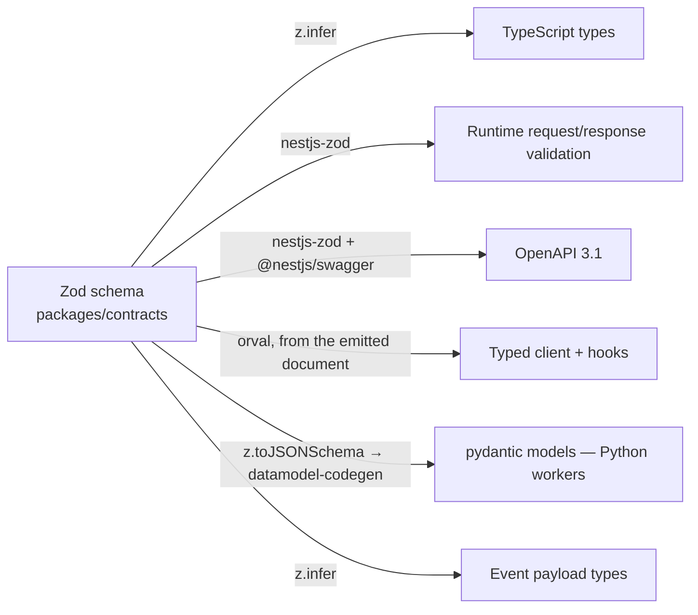

# Metrika — Contracts & API Design

> One Zod definition per concept. Everything else is derived, never duplicated.

---

## 1. The single-source-of-truth problem

The naive stack maintains four definitions of "a quote": a NestJS DTO with class-validator decorators, a `@nestjs/swagger` annotation, a frontend TypeScript interface, and a worker-side model. They drift. Every drift is a production bug that types did not catch because each side was internally consistent.

Metrika defines a concept once, in Zod, in `packages/contracts`, and derives the rest:



There is no hand-written DTO, no hand-written frontend interface, no hand-written worker model, anywhere in the repository. A lint rule flags `interface` declarations in `apps/api/src/**/api/**` to catch the drift at the moment it starts.

---

## 2. `nestjs-zod` — the decision and its escape hatch

ADR-0009 chose ts-rest, gated on a Phase 0 spike. The spike ran and ts-rest
failed it — `@ts-rest/core` hard-pinned to Zod 3 internals, no publish of any
kind in fourteen months, and `@ts-rest/open-api` emitting silently empty schemas
against Zod 4. The documented fallback was taken. See
[ADR-0019](./adr/0019-nestjs-zod-contracts.md), which supersedes ADR-0009 and
records the measurements.

A schema in `packages/contracts` becomes a DTO in `apps/api`, and the controller
is type-checked against it:

```ts
// apps/api/src/modules/quotes/quotes.dto.ts
import { metrikaDto } from '../../shared/http/zod-dto.js';
import { CreateQuoteRequest, QuoteResponse } from '@metrika/contracts';

export class CreateQuoteRequestDto extends metrikaDto(CreateQuoteRequest) {}
export class QuoteResponseDto extends metrikaDto(QuoteResponse) {}
```

```ts
// apps/api/src/modules/quotes/quotes.controller.ts
@Post()
@ZodResponse({ status: 202, type: QuoteResponseDto })
async create(@Body() body: CreateQuoteRequestDto): Promise<QuoteResponseDto> { … }
```

`packages/contracts` stays pure Zod — `createZodDto()` drags in a framework, and
the boundary rule there permits only `zod`. The DTO wrappers therefore live in
`apps/api`, next to the controllers that use them, and nothing outside `apps/api`
needs them because the client is generated from the emitted OpenAPI document
rather than from the wrapper objects.

**Two registrations, or response validation is off.** `metrikaDto()` passes
`{ codec: true }`, which is what makes `@ZodResponse` check the handler's return
against the schema's _output_ type — `.brand()` is output-only in Zod, so
without it a plain unbranded string satisfies a branded-ID response field and
ships. `@ZodResponse` then only ATTACHES metadata; the global
`{ provide: APP_INTERCEPTOR, useClass: ZodSerializerInterceptor }` provider in
`AppModule` is what reads it and parses the response at request time. Either one
alone is silent. A lint rule makes `metrikaDto()` the only sanctioned
`createZodDto` call site, and `apps/api/test/health.integration.test.ts` plus
`apps/api/test/response-validation.test.ts` fail if either registration is
removed.

**The risk, stated plainly:** `@nestjs/swagger` drags `class-transformer` and
`class-validator` in as peers even though `nestjs-zod` replaces them for
validation, and neither library's default OpenAPI path emits a 3.1-versioned
document — the version is overridden by hand, in exactly one function that every
emitter calls.

**Why the risk is acceptable:** the source of truth is Zod, not `nestjs-zod`.
The DTO classes are one-line structural wrappers around schemas that would
survive unchanged. That is the same bounded migration cost ADR-0009 predicted,
and paying it once is the evidence that it stays bounded.

---

## 3. REST design

Base path `/api/v1`. Resource-oriented, plural nouns, nested only one level deep.

```
POST   /api/v1/organizations
GET    /api/v1/organizations/:organizationId/members
POST   /api/v1/organizations/:organizationId/invitations

GET    /api/v1/projects?cursor=&limit=&filter[status]=&sort=-createdAt
POST   /api/v1/projects
GET    /api/v1/projects/:projectId

POST   /api/v1/model-versions/upload-session
POST   /api/v1/upload-sessions/:uploadSessionId/complete
DELETE /api/v1/upload-sessions/:uploadSessionId
GET    /api/v1/model-versions/:modelVersionId
POST   /api/v1/model-versions/:modelVersionId/confirm-units
POST   /api/v1/model-versions/:modelVersionId/approve-repair
GET    /api/v1/model-versions/:modelVersionId/analysis
GET    /api/v1/model-versions/:modelVersionId/preview-url        → short-lived signed URL
GET    /api/v1/model-versions/:modelVersionId/events             → SSE

GET    /api/v1/materials
GET    /api/v1/print-profiles
POST   /api/v1/print-configurations/validate
POST   /api/v1/print-configurations/fit-check
POST   /api/v1/price-estimates                                   → isEstimate: true, never a Quote

POST   /api/v1/quotes
GET    /api/v1/quotes/:quoteId
GET    /api/v1/quotes/:quoteId/events                            → SSE
POST   /api/v1/quotes/:quoteId/accept

GET    /api/v1/orders/:orderId
POST   /api/v1/orders/:orderId/payment-intent
POST   /api/v1/webhooks/payments/:provider                       → unauthenticated, signature-verified
```

**Long-running operations return `202`** with the resource in its current state. The client then subscribes to SSE or polls. No HTTP request waits on geometry or slicing.

### Pagination

Cursor-based everywhere. Offset pagination is not offered — it is wrong under concurrent inserts and gets slower as tables grow.

```ts
export const CursorPaginationQuery = z.object({
  cursor: z.string().optional(),
  limit: z.coerce.number().int().min(1).max(100).default(20),
});

export function paginated<T extends z.ZodTypeAny>(item: T) {
  return z.object({
    data: z.array(item),
    pagination: z.object({ nextCursor: z.string().nullable(), hasMore: z.boolean() }),
  });
}
```

The cursor is an opaque base64 of `(sortValue, id)`, matching the `(organizationId, createdAt DESC, id)` index. The tie-break on `id` matters — without it, rows sharing a `createdAt` are skipped or duplicated.

**No endpoint returns an unbounded collection**, and no response embeds a deeply nested object graph. A quote response carries item summaries and identifiers; the client fetches details it needs. This is enforced by response schemas, so it cannot regress.

### Errors

```ts
export const ApiErrorResponse = z.object({
  error: z.object({
    code: DomainErrorCode,
    message: z.string(),               // localised, safe to display
    details: z.record(z.unknown()).optional(),
    requestId: z.string(),
    retryable: z.boolean(),
  }),
});
```

| Code                                                                                                                    | HTTP |
| ----------------------------------------------------------------------------------------------------------------------- | ---- |
| `VALIDATION_FAILED`, `INVALID_PRINT_CONFIGURATION`, `UNSUPPORTED_FILE_FORMAT`, `CHECKSUM_MISMATCH`, `MALICIOUS_ARCHIVE` | 400  |
| `UNAUTHENTICATED`                                                                                                       | 401  |
| `INSUFFICIENT_PERMISSIONS`                                                                                              | 403  |
| `MODEL_NOT_FOUND`, `QUOTE_NOT_FOUND`, `ORDER_NOT_FOUND`, `ROUTE_NOT_FOUND`                                              | 404  |
| `INVALID_STATE_TRANSITION`, `QUOTE_SUPERSEDED`, `IDEMPOTENCY_KEY_REUSED`                                                | 409  |
| `QUOTE_EXPIRED`                                                                                                         | 410  |
| `FILE_TOO_LARGE`, `MODEL_TOO_COMPLEX`                                                                                   | 413  |
| `UNITS_NOT_CONFIRMED`, `MODEL_NOT_READY`, `DOES_NOT_FIT_BUILD_VOLUME`, `MODEL_NOT_PRINTABLE`, `IMPLAUSIBLE_SCALE`       | 422  |
| `RATE_LIMITED`, `QUOTA_EXCEEDED`                                                                                        | 429  |
| `GEOMETRY_ANALYSIS_FAILED`, `SLICING_FAILED`, `PAYMENT_VERIFICATION_FAILED`                                             | 502  |
| `INTERNAL_ERROR`                                                                                                        | 500  |

This table is the whole closed union, and `apps/api`'s `DOMAIN_ERROR_RESPONSE` is a
`Record` over it, so a code added to `DomainErrorCode` without a row here fails `tsc`.
`ROUTE_NOT_FOUND` is the one code no domain operation throws: it is what the exception
filter reports for a framework 404, so that an unmatched route does not have to ship
under a code this table pins at 400.

**A framework rejection keeps the framework's status and takes only its code from us**, so
`VALIDATION_FAILED` is the one code that may appear at any 4xx. This is not a theoretical
path: Fastify raises `FST_ERR_BAD_URL` (400) for a malformed percent-escape and
`FST_ERR_MAX_PARAM_LENGTH` (414) on any route carrying a `:param`, both before a single
line of application code runs, and both before Nest's pipeline exists at all — they are
answered by the `frameworkErrors` handler rather than the exception filter. Reading the
status from the table instead would have shipped Fastify's own 415 and 414 as 400.

**An `HttpException` with a 5xx status is never described to the client.** It is reported
as `INTERNAL_ERROR` at 500 and logged. `HttpException` is the class every Nest library
throws — `@nestjs/terminus` signals an unhealthy check with `ServiceUnavailableException`
carrying per-indicator detail — and its `message` is written for an operator, not for a
customer.

**A known domain failure never returns 500.** A generic 500 for a condition the domain understands is a bug — it tells the client nothing and hides a real state from monitoring.

Stack traces never cross the boundary. Unexpected errors log at `error` with a Sentry event and return `INTERNAL_ERROR` with the `requestId`, which is the only thing a support conversation needs to find the full trace.

### Headers

| Header                  | Direction | Purpose                                                                           |
| ----------------------- | --------- | --------------------------------------------------------------------------------- |
| `Authorization: Bearer` | in        | Clerk JWT                                                                         |
| `X-Request-Id`          | both      | Client may supply; otherwise generated. Echoed on every response including errors |
| `Idempotency-Key`       | in        | Required on `POST /quotes/:id/accept` and payment intent creation                 |
| `X-Metrika-Org-Id`      | in        | A _claim_, always verified against membership. Never trusted                      |

---

## 4. The API client package

```ts
// packages/api-client
export function createMetrikaClient(config: ClientConfig): MetrikaClient;

export interface ClientConfig {
  readonly baseUrl: string;
  readonly getAccessToken: () => Promise<string | null>;
  readonly onUnauthenticated?: () => void;
  readonly requestIdFactory?: () => string;
  readonly retry?: RetryPolicy;    // idempotent methods only, exponential backoff + jitter
}
```

Responsibilities, so components never touch `fetch`:

- Injects the bearer token and a request ID on every call.
- Retries only idempotent methods (`GET`, `HEAD`, and explicitly-marked safe `POST`s), with backoff and jitter, never on `4xx`.
- Normalises every failure into a typed `MetrikaApiError` carrying `code`, `requestId` and `retryable` — so `error.code === 'QUOTE_EXPIRED'` is exhaustively switchable in the UI.
- Threads `AbortSignal` for cancellation.
- Exports TanStack Query hooks with consistent query keys and sensible `staleTime` per resource.

A lint rule forbids raw `fetch` in `apps/web/src/features/**`. There is one HTTP layer.

---

## 5. Crossing into Python

`pnpm contracts:emit` (`scripts/contracts-emit.mjs`) is the whole chain. `packages/contracts/src/json-schema.ts` turns the **emitted** Zod schemas into ONE JSON Schema document with a `$defs` entry per contract, and `datamodel-code-generator` turns that into pydantic models committed as `apps/workers/packages/metrika_core/src/metrika_core/contracts/__init__.py`.

"Emitted" is a table, not every export. `json-schema.ts` declares two: `EMITTED` is what Python is given, `TS_ONLY` is what it is deliberately not given. Their union is exactly the package's exported Zod schemas and their intersection is empty, both asserted in `packages/contracts/test/json-schema.test.ts` — so a schema cannot fall out of both and reach neither the boundary nor a reviewer. `emitJsonSchemas()` walks `EMITTED` alone, which is what makes a `TS_ONLY` schema **absent from the only loop that could carry it across** rather than merely forbidden from it. See [ADR-0039](./adr/0039-contracts-typescript-only-exports.md), which chose this over widening the construct allowlist and over a second subpath export.

**No `zod-to-json-schema` dependency, and there must not be one.** Zod 4 ships `z.toJSONSchema()`, and `packages/contracts` may import nothing but `zod` (§7 of [ARCHITECTURE.md](./ARCHITECTURE.md)) — a second package here propagates to every consumer including the browser bundle.

One document rather than a file per schema, because the generator names a model after its `$defs` key and because a nested reference then emits `$ref`. Emitted per-schema instead, `Money.currency` inlines the currency enum and the generator writes a **second** Python enum beside `CurrencyCode` — two classes for one contract, invisible from TypeScript.

CI runs the emission and fails on `git diff --exit-code` (the `contracts` job). A TypeScript contract change that is not reflected in the Python models breaks the build immediately, at the point of change, rather than at runtime in a worker three weeks later. `packages/contracts/test/json-schema.test.ts` asks a weaker version of the same question in `pnpm verify` — a class per emitted schema, no class for a `TS_ONLY` one, every pattern verbatim, every enum member — so the answer is not CI-only. It also asks two questions CI cannot: that the two tables still partition the exports and that each name is bound to the export of that name, which are the only guards against a schema reaching neither side, or reaching Python under the wrong class name.

This is deliberately a build-time artefact rather than a runtime dependency — the workers stay a pure Python project with no Node requirement in their image.

### What crosses only because it was made to

Two constraints have no JSON Schema keyword and would otherwise be **dropped silently**, leaving the generated model strictly more permissive than the Zod schema defining it — the same direction, and the same invisibility, as the `\d` defect below.

- **Finiteness.** `z.number()` rejects `NaN`, `+Infinity` and `-Infinity`. A bare pydantic `float` accepts all three. Measured on the pinned `pydantic 2.13.4`, before the fix: `Millimeters` accepted `NaN`, `±inf`, `"12.5"` and `True`; the four non-negative units accepted `+inf`. Their partial protection was **accidental** — `ge=0` happens to filter `NaN` (every comparison with it is false) and `-inf`, while `+inf >= 0` passes. So `src/units.ts` carries `minimum`/`maximum` at `±Number.MAX_VALUE`, which **is** the set of finite doubles. Those bounds are a no-op on the Zod side; that is exactly why they are easy to delete and must not be. `CLAUDE.md` puts the stakes plainly: a slicer result is an exact number or absent, never an unbounded one, and these five are the quantities that flow into money — produced by the side that has no Zod.
- **The input type.** pydantic's lax mode reads `"12.5"` and `True` as floats, and `"2"` and `True` as ints; Zod rejects all four. `datamodel-codegen --strict-types str bytes int float bool` closes it. An `int` is still accepted for a `float`, because `z.number()` accepts one — the fix must not become a reverse divergence.

The one place this leaves Python **stricter** than Zod is `Money.exponent`, which rejects `2.0`: JavaScript has a single number type, so `z.number().int()` sees `2.0` as `2` and takes it. It is unreachable on the wire — `JSON.stringify(2)` emits `2`, never `2.0` — and it is asserted rather than left to be discovered.

### What does not cross

Four things, and each one is a property of the boundary rather than a defect to fix:

- **Anything in `TS_ONLY`.** A wire type between `apps/api` and `apps/web` that `apps/workers` has no use for — `MeResponse` and `MembershipSummary` today. They are also the schemas that _could_ not cross: `MeResponse.memberships` is an array and `timezone` is `.optional()`, and the construct allowlist in `packages/contracts/test/json-schema.test.ts` rejects both by name. Widening it for them would send every Phase 1 response schema into a package with no database and no user, and would owe a Python-side probe per construct; [ADR-0039](./adr/0039-contracts-typescript-only-exports.md) records that alternative and the trigger that would revisit it. One direction only: a `TS_ONLY` schema may reference an `EMITTED` one, never the reverse — an unregistered schema nested inside a registered one is **inlined** rather than `$ref`'d, which is how a second `Currency` enum was once generated.
- **Branding.** `z.string().regex(…).brand<'QuoteId'>()` emits a plain constrained string, so `QuoteId` and `OrderId` are the same type in Python and are freely interchangeable there. Python gets validation, not identity; [ADR-0018](./adr/0018-branded-types.md) stops here and cannot be made to cross. The generated file says so in its header.
- **Regex flags.** `z.toJSONSchema()` emits a pattern's source and drops its flags **silently**. An `/i` on the Zod side therefore produces a Python model stricter than the schema defining it — which is why `src/brand.ts` spells case into its character classes.
- **`\d`.** ASCII-only in JavaScript, any Unicode decimal digit in Python. A pattern containing one makes the generated model strictly **more permissive** than Zod: `"3٥٠"` is accepted and read as `350`. `src/money.ts` writes `[0-9]` for this reason. Zod's own built-in formats (`z.e164()`, `z.iso.datetime()`, …) carry `\d` and cannot be edited here; [ADR-0027](./adr/0027-python-toolchain.md) decided against rewriting them in the emitter, so `apps/workers/packages/metrika_core/tests/test_generated_contracts.py` carries a rejection test per pattern-carrying model instead.

The Python suite **instantiates and validates**, never merely imports. ADR-0027 measured a generated model that passed `ruff`, `ruff format`, `mypy --strict` and `import` at exit 0 and then raised an uncaught `TypeError` on every payload.

It also reads the **generated source** rather than `model_json_schema()` when asking which patterns crossed. Measured with `z.iso.datetime()` in the emitted set: the generator writes `Annotated[AwareDatetime, Field(pattern="^\d{4}-…")]`, pydantic cannot apply a string pattern to a datetime, and it **discards the constraint without error** — the round-tripped schema comes back with no `pattern` at all, so a guard built on that view goes quiet on exactly the models that are broken. `test_every_pattern_in_the_generated_source_was_actually_applied` compares the two views and fails on the gap.

---

## 6. OpenAPI

Generated from the Zod DTOs by `@nestjs/swagger` + `nestjs-zod`, served at
`/api/v1/openapi.json`, with Scalar as the documentation UI. No generator in
this space emits a 3.1-versioned document by default, so the version must be
overridden explicitly — in exactly one `buildOpenApiDocument`, so a second
emitter added later cannot silently claim 3.0 while containing 3.1-only
constructs. See [ADR-0019](./adr/0019-nestjs-zod-contracts.md).

That function is `apps/api/src/openapi/build-document.ts`, and both consumers go
through it: `bootstrap.ts` builds the document once at boot and serves it, and
`apps/api/src/scripts/emit-openapi.ts` writes it to
`apps/api/openapi/openapi.json`, which is committed.

```bash
DATABASE_URL=… HEALTH_DEEP_TOKEN=… pnpm --filter @metrika/api openapi:emit
```

The environment goes on the command line because, unlike `start` and `dev`, the
emit script carries no `--env-file`. That is deliberate: a `--env-file` would
make a local run read real credentials while CI supplies dummies, so the two
would feed different inputs to an artefact that is compared byte for byte. The
values are only parsed, never connected to — see below.

The emit script runs against the module graph, never against a running system:
it calls `NestFactory.create()` — which instantiates every provider, all
`SwaggerModule.createDocument` reads — and deliberately never calls
`app.init()`, whose lifecycle hooks include `PrismaService.onModuleInit`'s
`$connect()`. So emission needs **no reachable database**. `DATABASE_URL` and
`HEALTH_DEEP_TOKEN` still have to be present and well-formed, because
`ConfigModule` validates the environment while the graph is built; they do not
have to point at anything that exists.

`@ZodResponse` documents the one status it also enforces, so every other status
a route really answers is declared beside it with `@ApiResponse` — the probes'
503 is in the document for that reason. A route documented as 200-only generates
a client that models its real failure as an unmodelled error.

`apps/api/openapi/` is in `.prettierignore`. The document is machine-generated
with `JSON.stringify(doc, null, 2)` and diffed byte-for-byte; Prettier's
`printWidth: 100` collapses short arrays that `JSON.stringify` expands, so
leaving it formatted makes `format:check` and the diff gate disagree with the
emitter permanently.

The gate is that CI diffs the generated spec against the committed baseline, so
a breaking change — a removed field, a narrowed type, a new required request
property — fails the build. That is what makes "do not break the client" a rule
rather than an aspiration.

**This gate is wired.** CI's `openapi` job runs
`pnpm --filter @metrika/api openapi:emit` and then
`git diff --exit-code -- apps/api/openapi/openapi.json`, so a document nobody
regenerated fails the build. The job needs no database: `emit-openapi.ts` never
calls `app.init()`, so no lifecycle hook fires and `PrismaService.$connect()` is
never reached — but `DATABASE_URL` and `HEALTH_DEEP_TOKEN` are still supplied
inline in the step, because `ConfigModule` validates the environment while the
module graph is built and `openapi:emit` deliberately carries no `--env-file`.
CI's `integration` job runs `apps/api/test/openapi.integration.test.ts` too, so
the runtime assertions about the document's shape execute on every pull
request alongside the byte-for-byte diff.

Not yet part of the gate: the `api-breaking-change` label that would let a pull
request update the baseline deliberately. Today every diff fails equally,
whether it is a rename nobody intended or a considered breaking change, and the
fix is the same — regenerate and commit. The label distinguishes those two
cases and arrives with the typed client that would be broken by the second one
(Plan 0B-2).

---

## 7. API versioning

`/api/v1` is in the path from day one. Since the only consumer is our own frontend, deployed together, v1 will live a long time. The policy for when a v2 becomes necessary:

- **Additive changes** (new optional fields, new endpoints, new enum values on responses) ship in v1.
- **Breaking changes** require v2 for the affected routes only. Under [ADR-0019](./adr/0019-nestjs-zod-contracts.md) that means a second controller and DTO set in `apps/api` mounted alongside the first — **not** two routers exported from `packages/contracts`, which imports nothing but `zod` and can hold neither `initContract().router()` nor `createZodDto()`. `packages/contracts` holds the schemas both versions parse against; the routes live in the app.
- A deprecated version is supported for 6 months after its successor ships, with `Deprecation` and `Sunset` headers.

New enum values are a subtle breaking change for a strict client, so response enums are typed as unions with a documented "unknown value" handling rule in the client — it surfaces unknown values rather than throwing.
