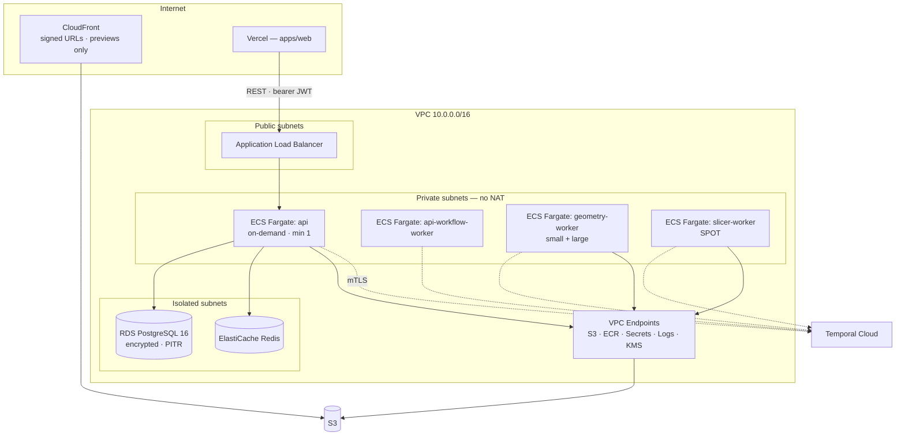

# Metrika — Infrastructure, Deployment & Cost

> Docker, Terraform, AWS, CI/CD, migrations, backups and a cost model. No manual console configuration, ever.

---

## 1. Docker

Three images. All multi-stage, non-root, pinned by digest, no build tooling in the runtime layer.

### API

```dockerfile
FROM node:22-bookworm-slim@sha256:<digest> AS base
ENV PNPM_HOME=/pnpm PATH=$PNPM_HOME:$PATH
RUN corepack enable

FROM base AS deps
WORKDIR /app
COPY pnpm-lock.yaml pnpm-workspace.yaml package.json ./
COPY packages/*/package.json packages/
COPY apps/api/package.json apps/api/
RUN --mount=type=cache,id=pnpm,target=/pnpm/store \
    pnpm install --frozen-lockfile

FROM deps AS build
COPY . .
RUN pnpm --filter @metrika/database generate \
 && pnpm --filter @metrika/api build \
 && pnpm deploy --filter @metrika/api --prod /out

FROM base AS runtime
RUN apt-get update && apt-get install -y --no-install-recommends dumb-init \
 && rm -rf /var/lib/apt/lists/*
WORKDIR /app
COPY --from=build --chown=node:node /out ./
USER node
ENV NODE_ENV=production
EXPOSE 3000
HEALTHCHECK --interval=30s --timeout=3s --start-period=20s \
  CMD node -e "fetch('http://localhost:3000/health/live').then(r=>process.exit(r.ok?0:1)).catch(()=>process.exit(1))"
ENTRYPOINT ["dumb-init","--"]
CMD ["node","dist/main.js"]
```

`pnpm deploy --prod` produces a self-contained output directory with production dependencies only — no workspace symlinks, no dev tooling, no source. Prisma engine binaries are copied explicitly, because a missing engine at runtime is a confusing failure.

### Geometry worker

```dockerfile
FROM python:3.12-slim-bookworm@sha256:<digest> AS base
COPY --from=ghcr.io/astral-sh/uv:latest /uv /usr/local/bin/uv

FROM base AS deps
WORKDIR /app
COPY apps/workers/pyproject.toml apps/workers/uv.lock ./
COPY apps/workers/packages/metrika_core/pyproject.toml packages/metrika_core/
COPY apps/workers/geometry/pyproject.toml geometry/
RUN uv sync --frozen --no-dev --package metrika-geometry

FROM base AS runtime
WORKDIR /app
COPY --from=deps /app/.venv /app/.venv
COPY apps/workers/packages/metrika_core ./packages/metrika_core
COPY apps/workers/geometry ./geometry
RUN useradd --system --uid 10001 --no-create-home metrika
USER 10001
ENV PATH="/app/.venv/bin:$PATH" PYTHONUNBUFFERED=1 PYTHONDONTWRITEBYTECODE=1
ENTRYPOINT ["python","-m","metrika_geometry.worker"]
```

Runtime task definition adds: `readonlyRootFilesystem: true`, a `tmpfs` scratch mount with a size cap, `cap_drop: ALL`, `no-new-privileges`, and memory/CPU limits per queue.

### Slicer worker

Same shape, plus the PrusaSlicer binary installed by checksum-verified download, and `infra/docker/slicer/PROVENANCE.md` recording the upstream version, source URL, image digest and an unmodified-binary attestation — see [SLICING.md](./SLICING.md#3-licensing--an-open-launch-blocking-question).

---

## 2. AWS architecture



**VPC endpoints instead of a NAT Gateway.** This is both the primary security control for the workers (no internet egress at all) and the single largest cost saving available in a small AWS footprint — a NAT Gateway is roughly $32/month plus per-GB processing before it moves a single useful byte. Only the Temporal Cloud connection needs egress, handled by a narrow route rather than a general-purpose NAT.

| Service | Configuration |
|---|---|
| ECS Fargate `api` | 0.5 vCPU / 1 GB, min 1 / max 4, target-tracking on CPU and ALB request count |
| ECS Fargate `api-workflow-worker` | Separate service, same image, different command. Isolates workflow processing from HTTP |
| ECS Fargate `geometry-worker` | Two services: small (1 vCPU / 2 GB) and large (2 vCPU / 8 GB), scaled on Temporal queue depth |
| ECS Fargate `slicer-worker` | 2 vCPU / 4 GB, **Fargate Spot**, scaled on queue depth |
| RDS | `db.t4g.small` staging (single-AZ), `db.t4g.medium` production (Multi-AZ), gp3, encrypted with a CMK, deletion protection, PITR |
| PgBouncer | Sidecar in transaction mode — Fargate scaling multiplies Prisma's per-process pool quickly |
| ElastiCache | `cache.t4g.micro`; deferred until the rate limiter needs it |
| S3 | Versioning on `originals/`, Intelligent-Tiering, lifecycle rules per prefix, Block Public Access |
| Secrets Manager | All secrets; injected as ECS task secrets, never as plain environment variables |
| KMS | Separate CMKs for S3 originals, RDS and Secrets Manager |
| CloudFront | Preview derivatives only, signed URLs, OAC to S3 |

**Temporal Cloud rather than self-hosted.** Self-hosting means running frontend, history, matching and worker services plus Cassandra or a large Postgres. The trade-off is a monthly bill and a dependency outside the VPC; the alternative is a platform team. See [ADR-0006](./adr/0006-temporal.md).

**Vercel for `apps/web` rather than ECS.** Better RSC support, preview deployments per pull request, edge caching, and no container to operate for the frontend. The cost is two deploy surfaces, two secret stores and a cross-origin API — the last of which is neutralised by using bearer tokens rather than cookies ([SECURITY.md](./SECURITY.md#4-authentication-and-session-security)). Revisit if the split becomes a genuine operational drag.

---

## 3. Terraform

```
infra/terraform/
├── modules/
│   ├── network/          # VPC, subnets, endpoints, security groups
│   ├── database/         # RDS, parameter group, PgBouncer, backups
│   ├── cache/            # ElastiCache
│   ├── storage/          # S3 buckets, lifecycle, CloudFront, OAC
│   ├── ecs-cluster/      # cluster, capacity providers, execution roles
│   ├── ecs-service/      # reusable service: task def, autoscaling, logs, alarms
│   ├── secrets/          # Secrets Manager, KMS
│   ├── observability/    # alarms, dashboards, OTLP egress
│   └── github-oidc/      # deploy roles, no long-lived keys
├── envs/
│   ├── staging/          # separate AWS account, own state
│   └── production/       # separate AWS account, own state
└── shared/               # ECR, state bucket, DNS, OIDC provider
```

- **Separate AWS accounts** for staging and production. Account boundaries are the strongest available blast-radius control, and AWS Organizations makes them free.
- State in S3 with DynamoDB locking, versioned, encrypted, in the `shared` account.
- Every module is versioned; environments differ only by `tfvars`. If staging and production diverge structurally, staging stops being a test of production.
- `terraform plan` runs on every pull request touching `infra/` and posts the plan as a comment. `apply` requires an approved merge to `main` and a manual gate for production.
- **No manual console changes.** Drift detection runs nightly and opens an issue on any difference. A hand-edited resource is an outage waiting for the next apply.

---

## 4. CI/CD

`.github/workflows/ci.yml` — on every pull request:

| Job | Runs |
|---|---|
| `setup` | pnpm install `--frozen-lockfile`, uv sync `--frozen`; caches restored |
| `format` | `pnpm format:check` |
| `lint` | `pnpm lint` (`--max-warnings=0`) + `ruff check` + suppression-justification check |
| `typecheck` | `pnpm typecheck` + `mypy --strict apps/workers` |
| `test-unit` | `pnpm test:unit` + `pytest -m "not integration and not regression"` with per-package coverage gates |
| `test-integration` | Testcontainers: Postgres, Redis, MinIO, Temporal test env |
| `contracts` | `pnpm contracts:emit && git diff --exit-code`; OpenAPI baseline diff |
| `build` | `pnpm build` + container builds (not pushed on PRs) |
| `security` | `pnpm audit`, gitleaks, Trivy on images, CodeQL |
| `e2e` | Playwright against an ephemeral stack (docker compose + fakes) |

`main` additionally: push images to ECR, `terraform apply` to staging, `prisma migrate deploy`, ECS rolling deploy, smoke tests, then a **manual gate** before production.

Turborepo remote caching (Vercel Remote Cache) means unchanged packages cost nothing. A typical pull request touching one feature runs in well under two minutes.

Nightly: slicer regression suite, dependency audit, Terraform drift detection, estimate-calibration report.

**Nothing deploys if any gate fails.** There is no override; a broken gate is fixed, not bypassed.

---

## 5. Database migrations

`prisma migrate dev` is a **local-only** tool. Production uses `prisma migrate deploy` against reviewed, committed SQL.

### Expand/contract, always

Renaming `Quote.total` to `Quote.totalMinor` is four deploys, not one:

```
1. ADD COLUMN "totalMinor" BIGINT NULL                    -- additive, safe
2. Backfill in batches; write to both columns             -- application change
3. Read from "totalMinor"; stop writing "total"           -- application change
4. DROP COLUMN "total"                                    -- destructive, marked
```

Rules enforced by a CI check that parses generated SQL:

| Statement | Rule |
|---|---|
| `ADD COLUMN ... NOT NULL` without a default | **Blocked** — rewrites the table |
| `DROP COLUMN` / `DROP TABLE` / type narrowing | Requires `-- metrika:destructive-ok <reason>` |
| `CREATE INDEX` | Must be `CONCURRENTLY`, outside a transaction |
| `ALTER TABLE ... SET NOT NULL` on a large table | Requires a validated check constraint first |
| Long-running backfill | Must be a batched script, never inline in a migration |

Migrations run as a one-off ECS task before the service rolling update, with `statement_timeout` and `lock_timeout` set so a migration that would block writes fails fast rather than taking the site down. Every migration is tested up **and** down against a seeded database in CI.

---

## 6. Backups and disaster recovery

| Objective | Target |
|---|---|
| RPO (database) | 5 minutes — PITR |
| RTO (database) | 1 hour |
| RPO (S3) | 0 — versioning + cross-region replication for `originals/` |
| RTO (full environment rebuild) | 4 hours from Terraform |

- RDS automated backups: 7 days staging, 30 days production, plus monthly manual snapshots retained 12 months.
- **Restore testing quarterly** — restore production's latest snapshot into a scratch environment, run migrations, run smoke tests, record the elapsed time. A backup that has never been restored is a hypothesis.
- S3 versioning on `originals/` protects against accidental or malicious overwrite; cross-region replication protects against a regional event.
- Terraform state is versioned and backed up; a full environment can be rebuilt from `main` plus a database restore.
- The DR runbook lives in `docs/runbooks/disaster-recovery.md` and names who does what, in order.

---

## 7. Cost model

Rough monthly estimates at low volume. **These are planning figures, not quotes — verify current pricing before committing.** AWS, Temporal and Clerk all change pricing, and Colombian data-transfer patterns may differ from assumptions.

| Item | Staging | Production (low volume) | Scales with |
|---|---|---|---|
| RDS PostgreSQL | ~$30 (t4g.small, single-AZ) | ~$90 (t4g.medium, Multi-AZ) | Data volume, connections |
| ECS Fargate — api | ~$18 | ~$36 (2 tasks) | Traffic |
| ECS Fargate — workflow worker | ~$18 | ~$18 | Workflow volume |
| ECS Fargate — geometry | ~$10 | ~$25 | **Model uploads** |
| ECS Fargate — slicer (Spot) | ~$5 | ~$20 | **Slice requests** — the main variable |
| ElastiCache | ~$12 | ~$12 | — |
| S3 storage | ~$1 | ~$5 | **Model storage growth** |
| S3 requests + CloudFront | ~$2 | ~$10 | Preview traffic |
| ALB | ~$18 | ~$18 | Fixed |
| **NAT Gateway** | **$0** | **$0** | *Avoided via VPC endpoints — would otherwise be ~$35+ each* |
| VPC endpoints | ~$15 | ~$22 | Endpoint count |
| Secrets Manager, KMS | ~$5 | ~$8 | — |
| Temporal Cloud | shared | ~$100+ | Actions per month — **verify current pricing** |
| Vercel | free | ~$20 | Bandwidth, build minutes |
| Clerk | free | ~$25+ | MAU |
| Grafana Cloud | free | free → ~$50 | Ingest volume |
| Sentry | free | ~$26 | Event volume |
| **Total** | **~$135** | **~$485** | |

### Cost drivers, ranked

1. **Slicing CPU.** A slice is 10–60 s of 1–2 vCPU. At 1,000 slices/month that is roughly 10–30 vCPU-hours — trivially cheap. At 100,000 it is the largest line item. The mitigations are already structural: the content-addressed cache, Fargate Spot, and per-org rate limits.
2. **S3 storage growth.** Originals accumulate forever unless lifecycle rules move them. Intelligent-Tiering plus Glacier IR at 90 days keeps this small; without it, it compounds.
3. **Temporal actions.** Priced per action. Chatty workflows (frequent heartbeats, many small activities) cost more than coarse ones — a real design consideration, not just a billing footnote.
4. **RDS.** Steady, predictable, upgradeable.
5. **Data transfer.** Preview downloads through CloudFront. Small per-model because previews are decimated; another payoff of that decision.

### What stays small, and what does not

Staying small indefinitely: RDS at this data volume, Redis, ALB, secrets, observability. Growing directly with usage: geometry and slicing CPU, S3 storage, CloudFront egress, Temporal actions, Clerk MAU.

Guardrails from day one: AWS Budgets alarms at 50/80/100% of a monthly target, per-service cost anomaly detection, and a weekly cost report on the Cost dashboard. A runaway slicing loop should page before it is a four-figure surprise.
