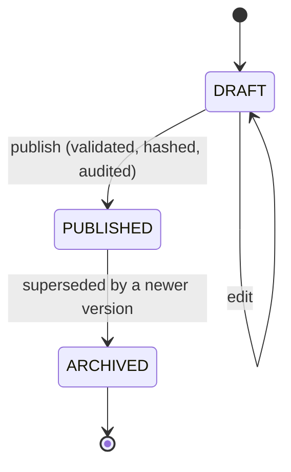

# Metrika — Pricing Engine

> The most business-critical code in the system. A pure, deterministic, versioned kernel in `packages/pricing-engine`.

---

## 1. Design constraints

| Constraint | Consequence |
|---|---|
| A quote is a commercial commitment | It must be reproducible indefinitely — from versioned inputs, never from current values |
| Administrators must change prices without a deploy | Rules are declarative data, versioned and published |
| Administrators must understand a price | Every quote carries a complete, ordered trace |
| Money must never be wrong by a rounding artefact | `Decimal` internally, integer minor units at the boundary, rounding at two declared points |
| Price is not a function of volume | The primary drivers are the slicer's actual filament mass, support mass and print time |
| The engine must be testable without infrastructure | Pure function: no I/O, no ambient clock, no randomness |

The purity constraint is not aesthetic. It is what makes golden-file testing possible, and golden-file testing is what makes a pricing change reviewable — a diff in an expected-output file shows exactly which quotes would change and by how much.

---

## 2. The kernel

```ts
// packages/pricing-engine/src/index.ts

export function computePrice(input: PriceInput): Result<PriceOutput, PricingError>;

export interface PriceInput {
  readonly evaluatedAt: IsoDateTime;          // injected — never Date.now()
  readonly ruleSet: PricingRuleSetVersionPayload;
  readonly items: readonly PriceItemInput[];
  readonly commercial: CommercialContext;
  readonly jurisdiction: JurisdictionContext;
}

export interface PriceItemInput {
  readonly slice: SliceMetrics;               // branded units — see DOMAIN_MODEL.md §4
  readonly geometry: GeometrySummary;
  readonly material: MaterialPricingSnapshot;
  readonly printer: PrinterCostSnapshot;
  readonly configuration: ConfigurationSummary;
  readonly quantity: PositiveInt;
}

export interface CommercialContext {
  readonly urgency: 'STANDARD' | 'PRIORITY' | 'RUSH';
  readonly organizationTier: 'STANDARD' | 'PARTNER' | 'ENTERPRISE';
  readonly promotionCodes: readonly string[];
  readonly customerPricingOverrideId?: string;
}

export interface JurisdictionContext {
  readonly countryCode: CountryCode;
  readonly regionCode?: string;
  readonly taxConfiguration: TaxConfigurationSnapshot;
}
```

Hard rules, enforced by lint zones on the package:

- **No `Date`, no `Date.now()`, no `Math.random()`.** Time is `evaluatedAt`.
- **No imports** except `packages/contracts` and `decimal.js`.
- **No `number` arithmetic on money.** `Decimal` throughout, `bigint` at the boundary.
- **Every input is `readonly`.** The engine cannot mutate its arguments.
- **Returns a `Result`, never throws** for expected failures (unknown component kind, unsupported schema version, missing snapshot).

`SliceMetrics` uses branded units, so passing a raw `number` where `Grams` is expected does not compile. This is where the branding investment (`DOMAIN_MODEL.md` §4) pays for itself: the pricing engine is exactly the boundary where a unit mix-up becomes a wrong invoice.

---

## 3. Rule sets as typed, ordered, declarative data

Not a scripting language (unversionable in practice, a security surface, impossible to type). Not a hardcoded formula (requires a deploy for every business change). A **discriminated union of component kinds, evaluated in a declared order**:

```ts
export type PricingComponent =
  | { kind: 'MATERIAL_COST';         id: string; wasteFactor: DecimalString }
  | { kind: 'SUPPORT_MATERIAL_COST'; id: string; wasteFactor: DecimalString }
  | { kind: 'MACHINE_TIME';          id: string; includeDepreciation: boolean; includeEnergy: boolean }
  | { kind: 'SETUP';                 id: string; amountMinor: MinorUnitsString; perOrder: boolean }
  | { kind: 'LABOR';                 id: string; minutesPerPart: DecimalString; hourlyRateMinor: MinorUnitsString }
  | { kind: 'POST_PROCESSING';       id: string; byFinish: Record<FinishLevel, MinorUnitsString> }
  | { kind: 'PACKAGING';             id: string; tiers: readonly VolumeTier[] }
  | { kind: 'COMPLEXITY_SURCHARGE';  id: string; metric: ComplexityMetric; bands: readonly Band[] }
  | { kind: 'RISK_ADJUSTMENT';       id: string; byRiskBand: Record<RiskBand, DecimalString> }
  | { kind: 'URGENCY_MULTIPLIER';    id: string; byLevel: Record<Urgency, DecimalString> }
  | { kind: 'QUANTITY_DISCOUNT';     id: string; tiers: readonly QuantityTier[] }
  | { kind: 'TIER_DISCOUNT';         id: string; byTier: Record<OrganizationTier, DecimalString> }
  | { kind: 'PROMOTION';             id: string; code: string; effect: PromotionEffect }
  | { kind: 'MARGIN';                id: string; factor: DecimalString }
  | { kind: 'MINIMUM_ORDER';         id: string; floorMinor: MinorUnitsString }
  | { kind: 'TAX';                   id: string; source: 'JURISDICTION' };
```

The rule set version stores an ordered array of these plus currency, exponent, rounding policy and `engineSchemaVersion`.

**Adding a value requires no deploy. Adding a new *kind* requires a deploy** — which is correct, because a new kind is a new capability that needs code, tests and a golden-file update. `engineSchemaVersion` lets an engine refuse a rule set it does not understand rather than silently mis-evaluating it. This is the boundary between "configurable" and "programmable", and putting it here is deliberate: a pricing DSL that admins can write arbitrary logic in is a defect generator and an unreviewable security surface.

### Evaluation order

Order is declared by the array, but the engine validates it against a required phase ordering, because some orderings are simply wrong (applying tax before margin, for instance):

```
COST      → MATERIAL_COST, SUPPORT_MATERIAL_COST, MACHINE_TIME, SETUP, LABOR, POST_PROCESSING, PACKAGING
ADJUST    → COMPLEXITY_SURCHARGE, RISK_ADJUSTMENT, URGENCY_MULTIPLIER
MARGIN    → MARGIN
DISCOUNT  → QUANTITY_DISCOUNT, TIER_DISCOUNT, PROMOTION
FLOOR     → MINIMUM_ORDER
TAX       → TAX
```

A rule set with a `TAX` component before `MARGIN` fails validation at publish time with a typed error, not at quote time.

---

## 4. Worked example

Input (one item, standard urgency, standard tier, Colombia):

```
slice.filamentMassG        = 148.2 g
slice.supportMassG         = 31.7 g
slice.printDurationS       = 27,180 s   (7 h 33 m)
material                   = PLA, purchaseCostMinorPerKg = 95,000 COP, wasteFactor 1.05, markup 1.00
printer                    = X1C-class, hourlyMachineCostMinor 4,200, depreciationPerHour 1,800,
                             powerDrawW 180, setupMinutes 12, failureRateEstimate 0.06
geometry.overhangRatio     = 0.22 → RiskBand MEDIUM
quantity                   = 1
```

Trace produced:

```
#  component               calculation                                              amount (COP)
1  MATERIAL_COST           148.2 g × 1.05 waste ÷ 1000 × 95,000/kg                       14,783
2  SUPPORT_MATERIAL_COST   31.7 g × 1.05 waste ÷ 1000 × 95,000/kg                         3,162
3  MACHINE_TIME            7.55 h × (4,200 + 1,800)/h                                    45,300
                           + energy 7.55 h × 0.180 kW × 780 COP/kWh                       1,060
4  SETUP                   12 min × 38,000/h labour                                       7,600
5  LABOR                   18 min post-processing × 38,000/h                             11,400
6  PACKAGING               volume tier M (≤ 8,000 cm³)                                    6,000
                           ── subtotal (cost)                                            89,305
7  COMPLEXITY_SURCHARGE    overhangRatio 0.22 → band MEDIUM → ×1.08                       +7,144
8  RISK_ADJUSTMENT         failureRate 0.06, band MEDIUM → ×1.12                         +11,574
9  URGENCY_MULTIPLIER      STANDARD → ×1.00                                                    0
                           ── adjusted cost                                             108,023
10 MARGIN                  ×1.45                                                        +48,610
                           ── subtotal (pre-tax)                                        156,633
11 QUANTITY_DISCOUNT       qty 1 → ×1.00                                                      0
12 MINIMUM_ORDER           floor 60,000 → not applied                                         0
                           ── subtotal                                                  156,633
13 TAX                     IVA 19% (CO, exclusive, taxConfiguration v3)                  +29,760
                           ── total (unrounded)                                          186,393
14 ROUNDING_ADJUSTMENT     HALF_UP to nearest 50 COP                                          +7
                           ── TOTAL                                                      186,400
```

That table is not documentation of a hypothetical — it is a rendering of the `Quote.trace` JSONB, and the admin UI displays it directly. When a customer disputes a price in eighteen months, this is the answer.

---

## 5. Trace format

```ts
export interface PricingTrace {
  readonly schemaVersion: 1;
  readonly ruleSetVersionId: string;
  readonly ruleSetContentHash: string;
  readonly engineVersion: string;              // "pricing-engine@1.2.0"
  readonly evaluatedAt: IsoDateTime;
  readonly currency: CurrencyCode;
  readonly exponent: number;
  readonly roundingPolicy: RoundingPolicy;
  readonly inputSnapshots: {
    readonly materialProfileVersionId: string;
    readonly printerProfileVersionId: string;
    readonly printProfileVersionId: string;
    readonly sliceResultId: string;
    readonly geometryAnalysisId: string;
    readonly taxConfigurationId: string;
  };
  readonly lines: readonly PricingTraceLine[];
  readonly subtotalMinor: string;
  readonly taxMinor: string;
  readonly totalMinor: string;
}

export interface PricingTraceLine {
  readonly sequence: number;
  readonly componentId: string;
  readonly kind: PricingComponentKind;
  readonly label: string;                       // localisation key, not a Spanish string
  readonly inputs: Readonly<Record<string, string>>;   // decimal strings, never floats
  readonly formula: string;                     // human-readable, for the admin UI
  readonly amountMinor: string;
  readonly runningSubtotalMinor: string;
}
```

`label` is a localisation key so the trace renders in the viewer's language. `inputs` are decimal strings so the trace is exactly as precise as the computation — a JSON number would reintroduce the float problem in the audit record itself.

The trace is stored on `Quote.trace` and is **part of the immutable snapshot**. It is never regenerated; regenerating it would defeat its purpose.

---

## 6. Money and rounding

```ts
const RATE = new Decimal(materialCostPerKgMinor);   // full precision throughout
const cost = massG.div(1000).mul(wasteFactor).mul(RATE);
```

- All arithmetic is `Decimal` at 34 significant digits.
- **Rounding happens at exactly two points**: once per trace line (for display), once on the final total (authoritative), each using the mode and exponent from the rule set version's `roundingPolicy`.
- Because `sum(round(lines)) ≠ round(sum(lines))`, the total is authoritative and a `ROUNDING_ADJUSTMENT` line reconciles the displayed lines to it. This is visible in the trace, so the discrepancy is explained rather than mysterious.
- COP uses `exponent: 0` in practice with `totalRoundToNearestMinor: 5000` (nearest 50 pesos). USD would use `exponent: 2`. Both come from the rule set version; neither is a constant in code.
- Property tests assert the invariants: totals are non-negative, the sum of trace lines plus the adjustment equals the total exactly, and evaluating the same input twice produces byte-identical output.

---

## 7. Tax

Tax is jurisdiction-scoped, versioned, and resolved outside the kernel. The kernel receives a `TaxConfigurationSnapshot` and applies it:

```ts
{ taxCode: 'IVA', ratePercent: '19.0000', isInclusive: false, appliesTo: 'SERVICE',
  countryCode: 'CO', validFrom: '2017-01-01T00:00:00Z', taxConfigurationId: '...' }
```

There is no `if (countryCode === 'CO')` anywhere in `packages/pricing-engine`. Adding Mexico is a `TaxConfiguration` row plus a currency entry in the registry, not a code change. Inclusive-tax jurisdictions (where the displayed price already contains tax) are supported by the `isInclusive` flag, which changes the arithmetic but not the structure — this matters because several markets Metrika might expand into work that way, and retrofitting inclusive tax is invasive.

---

## 8. Versioning and publication



- Publishing validates the rule set against the engine schema, computes `contentHash`, sets `effectiveFrom`, archives the previous version, and writes an `AuditLog` entry naming the publisher.
- **Publishing never affects existing quotes.** Every quote holds `pricingRuleSetVersionId`; the pointer to "current" is only read when a *new* quote is created.
- A `PUBLISHED` version is immutable. Correcting a mistake means publishing a new version — the wrong one stays in history, which is the point.
- **Publication is gated by a preview diff**: the admin UI re-prices a fixed sample of recent quotes under the draft rule set and shows the price change distribution before allowing publish. A rule change that would have moved the median quote by 40% is visible before it goes live, not after.

---

## 9. Testing

| Layer | Approach | Target |
|---|---|---|
| Golden files | Fixture inputs → committed expected trace JSON. Any output change requires updating a golden file, which surfaces in the diff | Every component kind, every combination phase |
| Property tests | Rounding invariants; determinism (same input twice → identical bytes); monotonicity (more material never lowers the price); non-negativity | fast-check |
| Boundary tests | Zero mass, zero duration, minimum-order floor exactly hit, 100% discount, tax-inclusive vs exclusive, quantity tier edges | Explicit cases |
| Schema-version tests | An old rule set payload must still evaluate; an unknown `engineSchemaVersion` must produce a typed error, never a wrong number | Both directions |
| Regression corpus | A snapshot of real published rule sets re-evaluated on every engine change | Nightly |

**Coverage target: 100% line and branch.** The package is pure, small and entirely deterministic — there is no excuse for an untested branch in the code that decides what customers pay.

---

## 10. Calibration — closing the loop with reality

The pricing engine prices against *estimates* from PrusaSlicer. Estimates drift from reality, particularly for complex parts, and drift in that direction is invisible until margin has already been lost. This is the highest-probability commercial failure mode in the business.

The architecture's answer:

1. `ManufacturingJob` records `actualPrintSeconds` and `actualMassG` on every completed job (from Phase 11 — operators enter them; from Phase 14 the printer driver reports them).
2. A scheduled job computes the deviation distribution grouped by `printerProfileVersionId` × `materialProfileVersionId` × complexity band.
3. When the median deviation crosses a threshold, an alert fires with the affected profiles and the suggested correction factor.
4. Corrections are applied by publishing a new `PricingRuleSetVersion` — never by patching the engine.

This loop is why `MACHINE_TIME` and `MATERIAL_COST` are separate components with separate factors: the correction can be applied to whichever one is actually drifting.

Until roughly fifty real jobs have completed, **the rule set is calibrated against a model, not against a factory.** Treat the first orders as a calibration exercise, and expect the risk and complexity components to change materially. That is the honest state of any pricing engine before it has met production.

---

## 11. Estimated pricing before slicing

Customers want a price indication before waiting for a slice. Two rules make this safe:

1. The estimate is produced by the **same engine** with `SliceMetrics` derived from a geometric approximation (volume × infill heuristic × material density, time from a volumetric rate per printer profile), and it is marked `isEstimate: true` throughout the contract and the UI.
2. **An estimate is never a `Quote`.** It has no `quoteId`, cannot be accepted, and is not persisted as a commercial record. It is a separate `PriceEstimate` response type.

Blurring these two would be the fastest route to honouring a price the system never actually computed.
