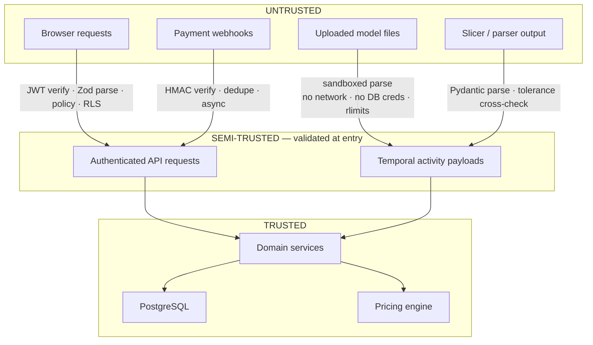

# Metrika — Security Architecture & Threat Model

> Customer 3D models are confidential architectural intellectual property. Treat every uploaded file as hostile and every model as a trade secret.

---

## 1. Assets, ranked

| Asset                      | Why it matters                                                                                                                             | Worst case                                       |
| -------------------------- | ------------------------------------------------------------------------------------------------------------------------------------------ | ------------------------------------------------ |
| **Customer 3D models**     | An unreleased building design. Losing one is a professional catastrophe for the customer and an existential reputational event for Metrika | Competitor obtains an architect's unbuilt design |
| Authentication credentials | Account takeover → access to all of the above                                                                                              | Full tenant compromise                           |
| Payment data               | Regulatory and financial exposure                                                                                                          | Fraud, liability                                 |
| Pricing rules and margins  | Commercially sensitive                                                                                                                     | Competitor intelligence                          |
| Compute capacity           | Slicing is genuinely expensive per request                                                                                                 | Cost-amplification attack                        |
| Audit logs                 | The record of what happened                                                                                                                | Undetectable tampering                           |

The ranking matters because it drives where effort goes. Confidentiality of customer geometry is the top priority, above availability.

---

## 2. Trust boundaries

Every arrow crossing into a more-trusted zone has a named, testable control. Nothing crosses on faith.

---

## 3. Hostile model files — the primary attack surface

A 3D model parser is a complex binary/text parser processing attacker-controlled input. This is the highest-risk code in the system, and it is treated accordingly: **it runs where a full compromise gains almost nothing.**

### Isolation

The geometry worker task:

| Control      | Setting                                                                                                                |
| ------------ | ---------------------------------------------------------------------------------------------------------------------- |
| Network      | **No egress.** VPC endpoints to S3 and Temporal only. No NAT, no internet route                                        |
| Database     | **No credentials exist in the task.** Workers cannot reach Postgres at all                                             |
| Filesystem   | Read-only root; `tmpfs` scratch with a hard size cap                                                                   |
| User         | Non-root, no shell in the runtime layer                                                                                |
| Capabilities | All dropped (`--cap-drop ALL`), `no-new-privileges`                                                                    |
| Seccomp      | Default Docker profile, tightened over time                                                                            |
| Memory       | `RLIMIT_AS` 2 GB (small queue) / 8 GB (large queue); container limit above it so the process dies before the task does |
| CPU          | `RLIMIT_CPU` plus a Temporal activity timeout plus an in-process `SIGALRM` — three independent stops                   |
| Lifetime     | One task per activity where practical; scratch scrubbed unconditionally, including on failure                          |

The "no database credentials" property is the one that matters most. An attacker achieving remote code execution in the parser lands in a task with no network, no credentials, no persistent storage, and a read-only filesystem, holding only the file they already uploaded. That is the whole point of workers being stateless compute.

### Format-specific defences

| Format  | Threat                                                | Control                                                                                                          |
| ------- | ----------------------------------------------------- | ---------------------------------------------------------------------------------------------------------------- |
| **3MF** | Zip bomb                                              | ≤ 500 entries, ≤ 200:1 compression ratio, ≤ 4 GB total uncompressed, streaming size accounting during extraction |
| **3MF** | XML entity expansion (billion laughs)                 | `defusedxml` — DTDs and external entities disabled entirely                                                      |
| **3MF** | Zip path traversal (`../`)                            | Entry names validated against an allowlist pattern; extraction to a canonicalised path with a containment check  |
| **STL** | Header-declared triangle count mismatch               | Cross-check `(fileSize - 84) / 50`; reject on mismatch before allocating                                         |
| **STL** | NaN / Inf coordinates                                 | Rejected at parse; they cause infinite loops and pathological behaviour downstream                               |
| **OBJ** | `mtllib` / `map_Kd` path traversal                    | All external references stripped, never resolved                                                                 |
| **OBJ** | SSRF via `http://` texture reference                  | Same — plus no network egress as the second layer                                                                |
| **All** | Memory exhaustion via triangle count                  | Pre-parse estimation, then hard limits                                                                           |
| **All** | Algorithmic complexity attack (pathological topology) | Wall-clock timeout with heartbeat, so it is detected in seconds                                                  |
| **All** | Extension spoofing                                    | Magic-byte and structural detection; the extension is a hint, never a decision                                   |

Every one of these has a corresponding fixture in `fixtures/models/` and a test asserting rejection with the correct error code. A defence with no test is an intention.

---

## 4. Authentication and session security

- Clerk provides authentication only ([ARCHITECTURE.md](./ARCHITECTURE.md#19-authentication-architecture)). JWTs are verified against cached JWKS with a bounded refresh, checking `iss`, `aud`, `exp` and `nbf`.
- **Bearer tokens, not cross-site cookies.** With Vercel and AWS on different origins, a cookie-based session would require `SameSite=None` plus a CSRF token scheme. Bearer tokens in memory sidestep that class of problem entirely. Tokens are short-lived and refreshed by the Clerk SDK; they are never in `localStorage`.
- **Authorization never reads organization claims from the token.** The token establishes identity; the database establishes permission.
- Rate limits: 10/min/IP on auth endpoints; account lockout and MFA are Clerk's responsibility and are enabled.

---

## 5. Authorization — defence in depth

Three independent layers, all required:

1. **Policy functions** — pure, exhaustively tested, operating on the _loaded_ resource. Load-then-authorize forces the tenancy predicate into the query.
2. **Repository signatures** — every method requires an `AuthContext`. There is no signature that permits forgetting.
3. **Postgres RLS** — `app.current_org_id` set per transaction. A query that somehow escapes both layers returns zero rows.

**IDOR test suite:** for every resource type, an automated test creates two organizations and asserts that org A receives `403`/`404` (never `200`, never a leaked existence signal) for every endpoint against org B's resource IDs. This runs in CI on every pull request. It is the single highest-value security test in the codebase because IDOR is the most likely real vulnerability in a multi-tenant application.

**Existence is not leaked**: an unauthorized resource returns `404`, not `403`, when knowing it exists is itself information.

---

## 6. Storage

| Control               | Implementation                                                                                             |
| --------------------- | ---------------------------------------------------------------------------------------------------------- |
| Private by default    | Block Public Access on every bucket; no bucket policy grants anonymous read                                |
| Encryption at rest    | SSE-KMS with a Metrika-owned CMK; a separate key for `originals/`                                          |
| Encryption in transit | TLS 1.2+ enforced by bucket policy (`aws:SecureTransport`)                                                 |
| Upload URLs           | 5-minute TTL, content-length range condition, content-type condition, one session ID                       |
| Download URLs         | 60-second TTL, `Content-Disposition: attachment`, never logged, never in a referrer                        |
| Originals on CDN      | **Never.** A CDN cache outlives the authorization decision that produced the URL                           |
| Previews on CDN       | CloudFront signed URLs; content-hash keys so the cache is immutable and safe                               |
| Worker IAM            | Scoped to specific prefixes; the geometry worker cannot read `gcode/`, the slicer cannot read `documents/` |
| Versioning            | Enabled on `originals/` — protects against accidental or malicious overwrite                               |
| Object Lock           | Considered for `gcode/` and `documents/` as commercial evidence; deferred to V1                            |
| Access logging        | S3 server access logs to a separate account-level bucket                                                   |
| Audit                 | Every signed-URL issuance for an original writes an `AuditLog` row with actor, resource and request ID     |

Signed URLs appear in the Pino redaction path list and in the Sentry `beforeSend` scrubber. A signed URL in a log is a credential in a log.

---

## 7. Payment security

- **Never trust browser-reported success.** Order state changes only on a verified webhook or a server-side status query.
- Webhook handling: verify HMAC over the **raw body** (before any JSON parsing — parsing then re-serialising breaks signature verification and is a classic bug), enforce a ±5-minute timestamp window, insert into `WebhookEvent` with `UNIQUE(provider, providerEventId)`, return `200` immediately, process asynchronously through the outbox.
- Secrets in AWS Secrets Manager, rotated on a schedule.
- Card data never touches Metrika — hosted checkout or provider-tokenised flows only. This keeps PCI scope at SAQ-A.
- Refunds and price overrides require an elevated platform role and always write an `AuditLog` entry with a reason.

---

## 8. Application security

| Threat                     | Control                                                                                                                                 |
| -------------------------- | --------------------------------------------------------------------------------------------------------------------------------------- |
| SQL injection              | Prisma parameterises everything. Raw SQL requires `$queryRaw` with tagged templates; a lint rule forbids `$queryRawUnsafe`              |
| XSS                        | React escapes by default. `dangerouslySetInnerHTML` is banned by lint. CSP with nonces, no `unsafe-inline`, no `unsafe-eval`            |
| CSRF                       | Not applicable — bearer tokens, no cookie-based session                                                                                 |
| SSRF                       | Workers have no egress. The API makes outbound calls only to a fixed allowlist (Clerk, payment provider, Temporal, OTLP)                |
| Clickjacking               | `frame-ancestors 'none'`, `X-Frame-Options: DENY`                                                                                       |
| Open redirect              | Redirect targets validated against an allowlist                                                                                         |
| Mass assignment            | Zod schemas are strict; unknown keys are stripped or rejected, never passed through                                                     |
| Dependency vulnerabilities | `pnpm audit` + Renovate + Trivy on images, all in CI                                                                                    |
| Secret leakage             | Gitleaks in CI and in the pre-commit hook; GitHub secret scanning with push protection                                                  |
| Supply chain               | Lockfiles committed; `--frozen-lockfile` in CI; base images pinned by digest; Renovate excludes the slicer image from automatic updates |

Security headers on every response: `Strict-Transport-Security` with preload, `Content-Security-Policy`, `X-Content-Type-Options: nosniff`, `Referrer-Policy: strict-origin-when-cross-origin`, `Permissions-Policy` denying everything unused.

---

## 9. Rate limiting and abuse

Slicing costs real CPU money per request. This makes cost amplification a genuine attack, not a theoretical one.

| Scope             | Limit                         | Rationale             |
| ----------------- | ----------------------------- | --------------------- |
| Auth endpoints    | 10/min/IP                     | Credential stuffing   |
| General API       | 300/min/org                   | Baseline              |
| Model uploads     | 20/hour/org, 5 GB/day/org     | Storage abuse         |
| Geometry analysis | 50/hour/org                   | CPU abuse             |
| **Slicing**       | **60/hour/org, 5 concurrent** | The expensive one     |
| Price estimates   | 300/hour/org                  | Cheap, but not free   |
| SSE connections   | 10 concurrent/user            | Connection exhaustion |
| Public endpoints  | 60/min/IP                     | —                     |

Sliding-window counters in Redis, keyed by organization and endpoint class. Exceeding a limit returns `429` with `Retry-After`.

Beyond rate limits: per-organization monthly quotas with a soft warning and a hard stop, AWS Budgets alarms on Fargate and S3 spend, and an anomaly alert when an organization's slice rate deviates sharply from its own baseline. The slice cache is itself an abuse control — repeated identical requests cost nothing.

---

## 10. Privacy and confidentiality

- Models are private by default with no sharing mechanism at MVP. Sharing, when it arrives, is explicit, per-resource, expiring and audited.
- Preview derivatives are decimated, so even a leaked preview is an approximation rather than the source geometry.
- Internal staff access to customer models requires an elevated platform role, is logged with a reason, and is surfaced to the customer in an access log (V1).
- Analytics events carry identifiers and coarse categories only — never file names, dimensions, geometry or project names. A third-party analytics processor must never receive anything that describes a customer's building.
- Data deletion: account deletion purges personal data within 30 days and anonymises retained commercial records. The data map lives in [DOMAIN_MODEL.md](./DOMAIN_MODEL.md#9-data-retention).
- Colombian Ley 1581 de 2012 (habeas data) obligations — privacy notice, consent, and the rights to access, correct and delete — are handled by the deletion and export workflows. **A compliance review is a launch gate**, on the same footing as the AGPL review; this document describes the technical capability, not legal sufficiency.

---

## 11. Threat model

STRIDE, scoped to what is actually reachable in this system.

| #   | Threat                                  | STRIDE | Likelihood | Impact       | Control                                                                        | Verified by                                |
| --- | --------------------------------------- | ------ | ---------- | ------------ | ------------------------------------------------------------------------------ | ------------------------------------------ |
| 1   | RCE via malformed mesh parser           | E      | Medium     | Critical     | Sandboxed task: no network, no DB creds, read-only FS, rlimits, non-root       | Fixture tests + container config test      |
| 2   | Zip bomb in 3MF                         | D      | Medium     | High         | Entry/ratio/total limits, streaming accounting                                 | Fixture test                               |
| 3   | XML entity expansion in 3MF             | D      | Medium     | High         | `defusedxml`, no DTD                                                           | Fixture test                               |
| 4   | Memory exhaustion via huge mesh         | D      | High       | Medium       | Pre-parse estimation, size gates, `RLIMIT_AS`, sized queues                    | Fixture test (20 M triangles)              |
| 5   | Path traversal via zip entry or OBJ ref | T      | Low        | High         | Name validation, containment check, refs stripped                              | Fixture test                               |
| 6   | SSRF via OBJ texture reference          | I      | Low        | High         | Refs stripped + no egress                                                      | Fixture test + network policy test         |
| 7   | **IDOR on model/quote/order IDs**       | I      | **High**   | **Critical** | Policy on loaded resource + `AuthContext` in repositories + RLS                | **Automated cross-tenant suite, every PR** |
| 8   | Signed URL leaked via logs or referrer  | I      | Medium     | Critical     | Redaction list, short TTL, `Content-Disposition`, no CDN for originals         | Log-redaction test                         |
| 9   | Payment webhook forgery                 | S      | Medium     | High         | HMAC over raw body, timestamp window                                           | Integration test with a forged signature   |
| 10  | Webhook replay                          | T      | Medium     | Medium       | `UNIQUE(provider, providerEventId)`                                            | Integration test                           |
| 11  | Compute cost amplification              | D      | Medium     | High         | Rate limits, quotas, slice cache, budget alarms                                | Rate-limit integration test                |
| 12  | Auth bypass via forged JWT              | S      | Low        | Critical     | JWKS verification, `aud`/`iss`/`exp` checks                                    | Integration test with a forged token       |
| 13  | Privilege escalation via org role       | E      | Low        | High         | Roles from DB only, never from the token; separate platform-role table         | Policy unit tests                          |
| 14  | Dependency compromise                   | T      | Medium     | High         | Lockfiles, `--frozen-lockfile`, Renovate, Trivy, gitleaks                      | CI                                         |
| 15  | Insider access to customer models       | I      | Low        | Critical     | Elevated role required, audited, customer-visible access log (V1)              | Audit test                                 |
| 16  | Stack trace / internal detail leakage   | I      | Medium     | Low          | Exception filter maps to typed codes; traces never serialised                  | Integration test                           |
| 17  | Enumeration of resource IDs             | I      | Medium     | Low          | UUIDs, `404` for unauthorized, rate limits                                     | Cross-tenant suite                         |
| 18  | XSS via model or project name           | T      | Medium     | Medium       | React escaping, CSP, name length/charset validation                            | Component test                             |
| 19  | Tampering with pricing rules            | T      | Low        | High         | Publish requires an elevated role, is audited, and is immutable once published | Policy + audit tests                       |
| 20  | Loss of audit integrity                 | R      | Low        | High         | Append-only, no update/delete grants on the table to the application role      | Migration + permission test                |

### Explicitly out of scope for MVP

Stated so their absence is a decision rather than an oversight: DDoS beyond CloudFront and rate limits (accepted); a formal external penetration test (planned for Phase 12, before launch); SOC 2 (not a pre-revenue concern); customer-managed encryption keys (Future, enterprise); WAF rules beyond AWS managed rule sets (Phase 12).
